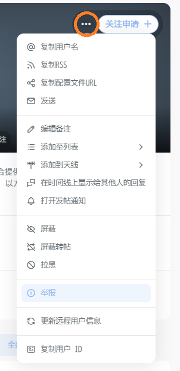
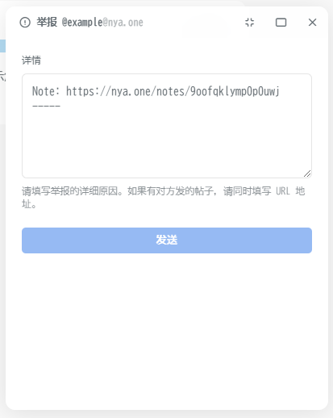

# 合理使用规约 <Badge type="tip" text="AUP" vertical="top" />

## 平等相待

每一位加入喵窝的用户都平等，监察员辅助管理员执行日常站务，不可拥有特权也不得为任何其他用户提供特权。如有因监察员滥用职权引发的失职行为发生，请参照 [检举说明]。

我们不希望任何利用喵窝漏洞的行为发生，因此如果您有发现任何配置上的缺失，请及时和我们取得联系，防止被不怀好意的用户发现并给我们的环境带来破坏；若有发现任何对于大家共同的美好环境的破坏行为，我们会采取一系列的限制措施。

## 内容规范

加入喵窝就意味着您愿意遵守喵窝的规则，愿意共同致力于维护这个来之不易的美好环境，和大家一起分享点滴的日常与喜悦，或是和有些技术相关的分享等等。

### 不被允许的内容

我们崇尚**普世价值观**，无法接受诸如以下有害社区环境的内容或行为的出现：

::: details 蓄意造谣

指在无法确定自己发送的消息内容可信度的情况下，依然坚持以置信口吻发送。

例如，亲自编造关于某一社会热点事件的「幕后真相」，以实现为自己获取关注度的行为。

如果内容并非原创，请附上来源链接的[网站备份]，以便其它用户参考查阅。

请注意原始消息来源的可信度，并自行对外源内容进行严格的准确性审查（同时请注意参考资料的准确性），以避免出现非蓄意的传谣情况。发送或转发不合事实的非原创内容同样会被认定为蓄意造谣行为。

如果您有发送争议内容的习惯且无法保证严格认真审查每一条原始消息的准确性，我们推荐您在其他更适合发送此类内容的实例去发送那些内容。

:::

::: details 侮辱

指故意伤害他人的名誉或人格。

该条可能会与 **蓄意造谣** 、 **人身攻击** 等同时出现。

:::

::: details 骚扰

指通过不当的言语冒犯对方，让对方产生反感情绪。

如果您觉得您被骚扰了，那您就是被骚扰了。

:::

::: details 欺诈

指故意告知对方虚假情况，或故意隐瞒真实情况，诱使对方基于错误判断作出意思表示。

:::
   
::: details 谩骂

指具有针对性的、带有主观恶意的负面言论。

该条可能会与 **侮辱** 、 **人身攻击** 等同时出现。

请注意一些可能的边界情况，如当针对的是人神共愤的对象时，该条不成立；当针对的是某个泛指或抽象的概念时，请不要对号入座。

如果您觉得因抽象的概念冒犯到了您的使用体验，我们建议您先尝试与内容发布者进行沟通。

:::

::: details 恐吓

指通过威胁的手段使对方害怕。

请注意一些可能的边界情况，不合时宜的「玩笑」也可以被算作该条内容，具体判定线为由被针对者的想法，与内容发送者无关。

如果您觉得您被恐吓了，那您就是被恐吓了。

如果您觉得条款中充斥着的封禁等严重处罚措施对您造成了恐吓，请不要注册。

:::

::: details 人身攻击

指在沟通对话时，攻击、批评对方个人因素相关之断言或质疑。

该条可能会与 **侮辱** 、 **谩骂** 等同时出现。

:::

::: details 道德绑架

指通过高尚道德的名义或口号，要求、胁迫或攻击别人并左右其行为。

具体案例相信各位已经很多见了，也有很多用户是道德绑架下的受害者。

如果您觉得您被道德绑架了，那您就是被道德绑架了，您可以向网友或是心理医生寻求帮助。请注意可能伴生的 **骚扰** 、 **恐吓** 等情况。

:::

::: details 恐怖主义

指有意制造恐慌行为的思想或行动。

该条可能会与 **恐吓** 、 **身份 / 性别 / 种族等歧视** 等同时出现。

请注意一些可能的边界情况，不合时宜的「玩笑」也可以被算作该条内容。通过以权力或暴力机关（如网信办、国安局、黑社会等）对他人产生威胁时同样符合该条判定。

:::

::: details 法西斯主义

指一种威权的极端民族主义。

具体案例相信各位已经很多见了，也有很多用户是法西斯主义的受害者。

:::

::: details 专制主义

指一种政府的形式，将统治权力集中在单一个体身上，也可以称为独裁主义。

请注意该条的适用对象为政府，具体的平台政策与政府无关。

:::

::: details 沙文主义

指极端的、不合理的、过分的爱国主义，或是认为自己的群体优越于其他群体的非理性信念。

例如，粉蛆也属于沙文主义。

:::

::: details 社会达尔文主义

指蔑视社会弱势群体，认为其应当遭受被淘汰的灭亡命运的思维模式。

请注意对弱势群体的关注和关爱，除了流氓头子，没有谁能保证永远都是强势群体。

:::

::: details 身份 / 性别 / 种族等歧视

指针对对方的身份、性别或是种族等进行欺辱或歧视等的行为。

请尊重每一个个体。

:::

::: details 隐私侵犯

指收集他人不愿被公开的信息的行为。

该条可能会与 **骚扰** 、 **恐吓** 、 **恐怖主义** 等同时出现。

:::

::: details 盗窃资源

指不正当占有（包括管领、支配、处分等）财产或非物质资产等行为。

例如，未授权的搬运行为也算盗窃资源，侵犯了原始发布者的知识产权。

喵窝不认同**公开发布**未持有分享授权的资源行为，如因此产生的任何纠纷均由用户本人承担，与喵窝无关。

具体法律条文请参见 [服务架构] 中提及的服务供应商与服务器所在地的相关法律。

:::

::: details 虚假账号 <Badge type="danger" text="不可申诉" />

指出于冒充其他用户，为自己带来利益的目的开设的账号。

该条可能会与 **欺诈** 、 **盗窃资源** 同时出现。

对于这类账号，我们会与身份的原主人尝试取得联系，获得进一步可能可行的解决方案。

:::

::: details 包含儿童的限制级内容 <Badge type="danger" text="不可申诉" />

指包含未成年或形似未成年角色的限制级（包括但不仅限于色情、人身伤害等）内容。

请注意， **关注此类内容的创作者** 或是 **与此类内容产生交互（评论、转发等）** 同样可能导致账号被封禁。

:::

::: details 其他滥用情况

指不包含在上述条目中的不正当或不合理地使用喵窝提供的服务的行为。

包含但不仅限于以下样例：

- 在无明确说明的情况下含有令人不适的内容（或链接）。
  > 如果对方不觉得这是一个玩笑，那这就不是一个玩笑。
  >
  > 对于链接，为避免误点击，我们建议您将相关链接拆散至非链接格式，或使用 `[dot]` 来代替 `.`
- 使用网盘进行病毒攻击或违法资源的分发。
  > 网盘仅为辅助您管理在喵窝上传的文件，并方便复用而设计的。您可以适当作为个人网盘使用，但因其上存储的内容并非私有，请注意相关的安全问题。
  >
  > 一些并非病毒的内容可能会因其使用的编译系统或依赖组件的行为被错误地标记为病毒，为了避免此类情况发生，我们推荐您上传任何可执行文件前都使用压缩包压缩一次。
  >
  > 如果您需要出于研究需要分发病毒样本文件，请使用加密压缩包，并明确标注这是一个病毒样本，不应当在不受控制的环境中执行。
- 长期发送不含原创价值的信息。
  > 例如无意义的乱码，或是监察员认为无法理解其意义的内容；或是将账号仅作为 fediverse 上的转发工具来使用（即不在 fediverse 上产生新信息）。
- 出于商业宣传目的注册账号。
  > 例如利用账号执行商业行为；或是将账号作为商业服务的宣传。
- 在无法标记敏感的场合使用敏感内容。
  > 例如将 NSFW 的媒体资源设置为头像或 banner ；或是在个人信息中包含应该需要折叠的敏感内容。
- 刷屏
  > 例如将过长的内容切割成多条发送，并因此占据时间轴上的多个长段文本位置。
  > 
  > 请使用适合分享长段内容（如 Page 功能）分享长段内容。

:::

良好的环境需要我们每一位成员来细心维护。

如果您发现有哪个实例存在大量上述行为，请第一时间与喵窝监察员联系以考虑中断实例通信；如果您发现有哪位喵窝用户存在类似行为，同样也麻烦您第一时间与我们联系检举，以避免对联邦宇宙的其他用户或是节点造成误会，甚至带来损失。

### 需要注意的内容

这里列出了一些需要注意的内容。喵窝允许这些内容的出现，但请注意相关的时机与格式。

#### 敏感内容

请善用内容折叠与敏感标记功能。

- 如果帖文包含 [NSFW] 或 可能引起 [PTSD] 等的内容，请使用内容折叠（隐藏内容），并标明提示性话语；
- 针对媒体资源（如图片与视频），请将其标记为敏感内容。

请避免出于非医疗或相关研究用途上传包含动物生殖器、消化道或呼吸道等描写的媒体资料。如果您实在有分享这些内容的需要，我们推荐您使用其他专注于此类内容分享的实例。

::: info 自动 NSFW 标注

部分媒体资源可能会被系统自动或管理员手动标记为 NSFW 。如果您觉得判定有误，可以在网盘里对应文件的选项中自行调整。

:::

#### 明星情怀

Fediverse 目前仍然是一个小众的解决方案，这也就意味着您可能并不便于像其他大众平台（如推特或是微博等）通过购买的方式获得大量虚假的粉丝，或是如同某些社区明星那样随便一条消息就能获得一呼百应的效果。如果您有强烈的网红情怀并且确实愿意来体验 Fediverse 的魅力所在，我们更推荐您使用一些大型的实例以达到某些类似于中心化服务器的体验，使用我们的服务时您就已经确定不会因实例用户过少不满足您的心理预期而产生本可以避免的厌弃甚至是敌视心理。

#### 关键词审查

喵窝没有关键词审查，请尊重自然语言的完整性，使用正规的语言文字表述意思；出于不同语言环境用户的理解方便考虑，建议您尽量避免沿袭对抗审查使用的混淆话术，并适当注意具有强烈时效性或是复杂上下文语境的固定表达。

#### 个人隐私保护

另外，请注意保护您的个人隐私信息，避免因真实身份信息泄露导致可能出现的安全隐患。

例如，为避免邮箱泄露，我们推荐您使用 `[at]` 或 `#` 等符号来替代邮箱中的 `@` 连接符。

#### 经济投资行为

由于经济市场波动的难以预计性，我们不推荐您在喵窝谈论太多与经济投资（例如股市、加密货币等）相关的话题，尤其注意不推荐向任何人作出投资建议。

如果您确实有谈论该话题的需求，您可以考虑发表仅关注者或指定用户可见的贴文，并强调投资的风险。公开渠道发表的错误投资预估会依照欺诈行为处理。请同时注意规避可能出现的包含商业宣传目的的滥用行为等违规内容。

或者如果您实在有太多花不完的钱想要用掉，您可以考虑 [赞助] 喵窝。

### 允许的内容

喵窝不限定交流的内容，无论是日常还是技术，工作或是生活，当成是树洞吐吐槽也都可以，但是请一定时刻记得**友善交流**。

Fediverse 系列的开放性为每一个实例都提供了无限的可能，之所以为 Fediverse 是因为它的开放性与去中心化，使得每一个人都有机会寻找到自己最心仪的实例，加入自己喜欢的社交群体。它不像那些中心化的平台拥有言论一边倒的情况，也不应因自己的认知而仅将目光局限于在使用规约的边缘打擦边球。

## 著作权与信息处理

由于每一个用户对其所有信息（个人信息、发表的内容、上传的文件等）享有一切权益与义务，因而：

1. **严格禁止** 任何未明确授权的转载行为。
2. 无论是否得到授权， **严格禁止** 出于正常使用目的之外的获取用户信息的行为。若有用户授权您使用其信息用于其他目的，请该用户导出自己的数据后私下发送给您。
3. 请确保您上传至喵窝的内容均为您持有著作权的原创内容，或是经由内容著作权持有者正式授权许可、遵守与内容创建者约定的转载行为的内容。
4. 我们仅被您授予有条件限制的存储与分发权；**不被授予且拒绝接受**任何使用您的信息进行盈利的行为：包括但不仅限于某些无良平台盗用用户数据进行商业化机器学习模型训练、将用户数据泄露给非必要的第三方机构等等。

数据安全是平台信任的基础，如果数据安全无法被保证，那么平台信任更无从谈起。确实从 Fediverse 的开放性设计上来讲，这种数据保护也不过是一厢情愿的自娱自乐，要作恶的随便起一个实例就能自动获得涌入的数据；但我们的态度是至少从我们能做的细微之处做起，用心呵护好每一位用户愿意托付给我们的信任，虽远远称不上是理想国，但至少也要是一方能稍微脱离一会现实污浊桎梏的净土。

如果出现侵犯他人著作权内容的行为，经由用户或著作权方投诉核实的，我们会与您取得联系协商解决；如果确认为主观侵犯，视具体情节严重程度，您的账号可能会被冻结。

若有任何侵犯到您著作权益的行为发生，您可以参见[检举说明]与我们取得联系。

## Bot 的使用

请参阅 [基于 Misskey 平台的周边生态开发] 所述的信息。

## 限制与申诉

包含 <Badge type="danger" text="不可申诉" /> 标记的条目指因违反该条目导致的限制不接受任何申诉。

针对违反其他条款导致您的账号遭到来自监察员的暂时限制，您可以在操作执行的 `30` 天内向管理员申请复议。需要注意的是，如果复议的裁定结果未发生改变，您的账号会被永久封禁。

受到限制后的账号将进入重点观察名单，若在此期间再有出现违反条款的情况出现或超过 `30` 天不活跃，该账号将会被永久封禁。

## 检举说明

::: warning 原则

我们并不认为检举是一种好行为，我们也不提倡检举，但我们更无法容忍破坏用户体验的内容和行为发生。所以，请确保您检举的内容确实违反了相关的条款，请不要将检举功能作为一种公报私仇的方式。

对于**滥用**检举功能的用户，我们也会实施相对应的限制策略。

:::

### 联络对象

- 如若您检举的是一般用户行为，您可以利用**站内检举系统**将相关信息发送给我们。
- 如若您检举的是监察员行为，请参照[联系我们]中的描述向管理员团队发送信息。

### 附带内容

为方便管理团队的判断，请您在检举时附带上以下内容：

1. 原始内容的[网站备份]。

    为避免原始内容作者悄悄删除其原始内容来反咬一口，我们建议您及时对原始内容进行备份。

    请注意，如果原始内容并非公开内容时，您可能会无法生成可以访问的网站备份，这种情况下您可以忽略这一条。
    
    另外，如果违反规则的用户为外站的用户，且其同样违反了外站的相关规则，我们建议您同时生成其原始内容链接的网站备份一并附上，以方便我们与其实例所在的管理团队取得联系时使用。

    我们不接受截图作为证据，图片是可以被轻易篡改的。

2. 其内容违反的条款。

    请明确标注这一点，以便帮助管理团队快速判断其具体的内容情况。

    如某内容触犯了多条条款，您可以一一将其列出。

    如果没有标注这一点或是标注了大量的无关条文，该次检举会被视为滥用检举功能。

3. 您新的联系方式。

    如果您因遭到了原始内容作者的负面行为导致您需要销毁或是登出当前账号以避免情绪失控或是人身遭到威胁等情况的发生，且希望管理团队能与您取得联系，请标注您新的联系方式。

    该联系方式可以是 matrix 账号，或是 fediverse 账号。我们不推荐使用电子邮箱（因为喵窝运行的电子邮箱服务是只收不发的），也不推荐任何中心化的通信服务（隐私相关的考虑）。

    请注意新身份与原始身份的隔离，以确保您的安全。

::: details 站内检举系统使用教程

您可以通过对目标 Note 点击右下方 更多 按钮找到**举报**功能。

您可以举报单独一条 Note ，或是在扩展的 用户子目录 选择举报这名用户。

如果您需要举报一名用户，您也可以在其主页右上角关注按钮旁 更多 按钮打开 用户子目录 选择举报这名用户。

在举报 Note 时，系统会自动带上该条 Note 的原始链接。请在分割线下方补充上述的 **附带内容**。

在举报用户时，详情输入框是空的，此时您可以直接补充上述的 **附带内容**。

请确保带上了附带内容，以尽可能简化并加速我们的处理流程，非常感谢您的理解与支持。

:::

[赞助]: /sponsor/
[检举说明]: #检举说明
[基于 Misskey 平台的周边生态开发]: /develop/peripheral/
[联系我们]: /contact/
[网站备份]: /appendix/#网站备份
[服务架构]: /service-structure/

[NSFW]: https://zh.wikipedia.org/wiki/NSFW
[PTSD]: https://zh.wikipedia.org/wiki/%E5%89%B5%E5%82%B7%E5%BE%8C%E5%A3%93%E5%8A%9B%E7%97%87
