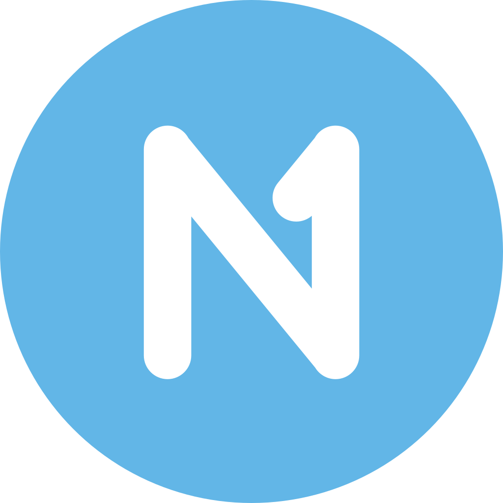
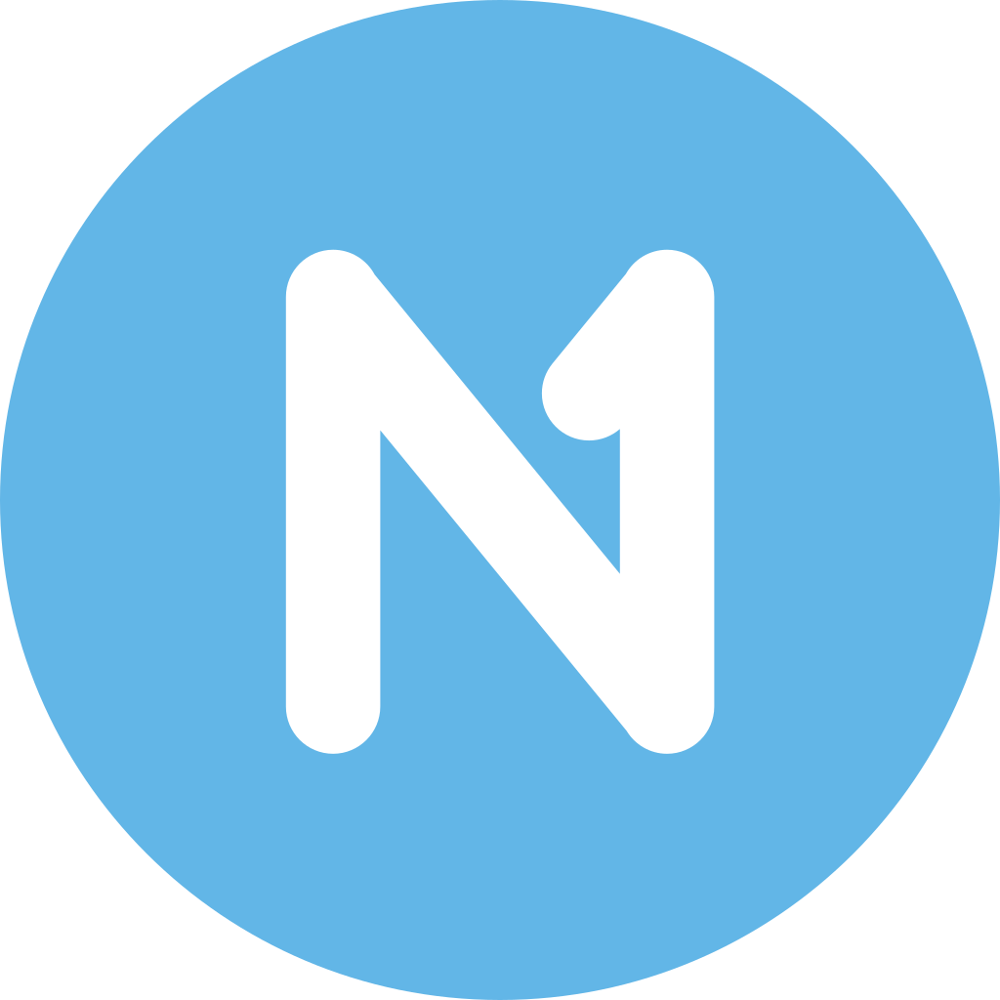
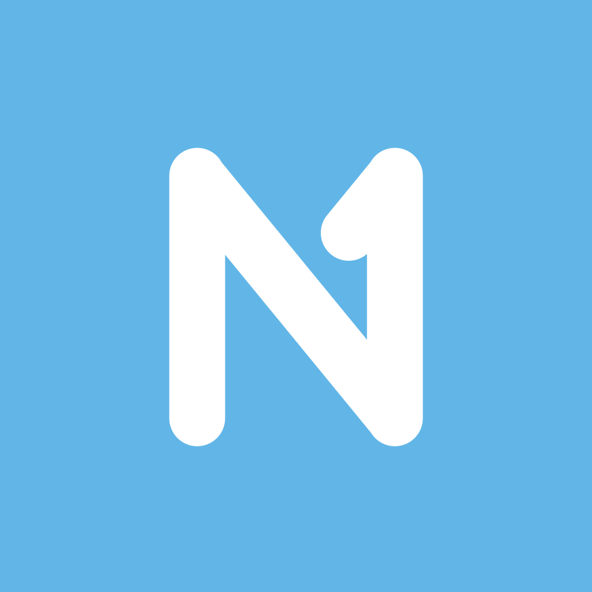
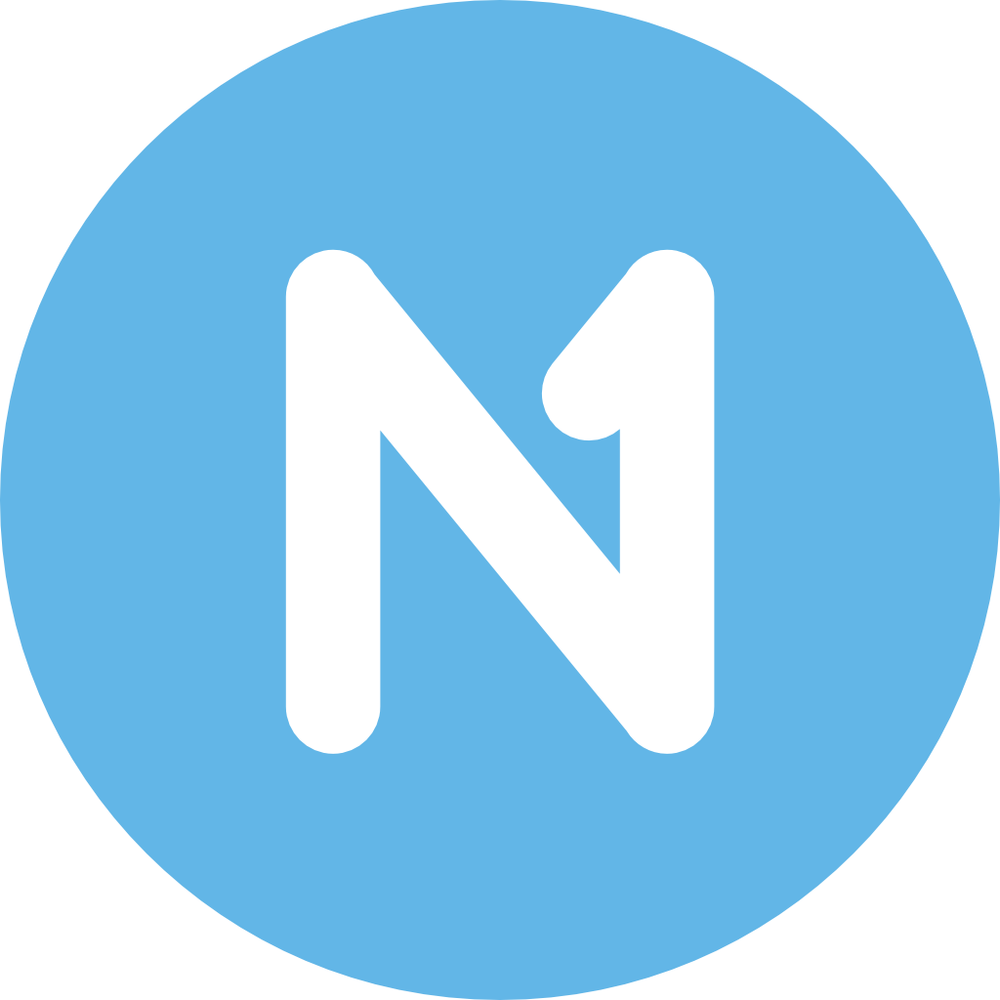
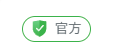
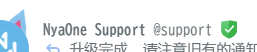
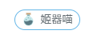
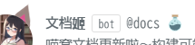

# 品牌资源

::: tip

所有喵窝官方使用的资源均为版权所有产物，在使用来自喵窝的资源时，请遵循下文所述的内容，非常感谢您的理解与支持。

当您遵循所有描述内容后，您可自由将这些资源使用在任何（商业或非商业，公开或非公开）场合，预祝您使用愉快。

:::

## 名称

当您需要显示喵窝的品牌时，我们推荐您使用以下表达，以尊重品牌，并避免产生误会：

| 语言环境         | 表达     |
|--------------|--------|
| 支持 CJK 字符的场合 | 喵窝     |
| 所有场合         | NyaOne |

特别的，当您不确定使用哪种表达比较合适时，您可以使用形如 `喵窝 (NyaOne)` 的双语表达。

::: warning 名称的补充说明

您可以在名称附近添加更多的补充说明，但请确保不要破坏名称本身的独立及完整性，如请不要故意将名称断开，或是使用其他含有诱导偏向的内容。

:::

## LOGO

我们提供矢量（SVG）和位图（PNG）格式的 LOGO 方便您使用。

其中 SVG 格式的我们还提供内裁切版本，即使用字符裁下背景，使剩余部分为一个整体的设计，方便您使用在需要作为整体呈现（如矢量图标按钮等）的场合。

如果您需要其他尺寸或是格式（如 JPEG 或是 WebP 等）的图像，您可以使用对应的工具进行转换。如果您需要更大的尺寸，请使用 SVG
图片进行缩放后后生成，以避免可能出现的锯齿边缘问题。

特别的，当您需要将 LOGO 作为彩色格式呈现时，为确保品牌显示一致性，请确认其主题色（即蓝色部分）为 `#62b6e7` （ rgb(98, 182, 231) ） 。

| 格式      | 圆底                                                                                         | 方底                                                                                            |
|---------|--------------------------------------------------------------------------------------------|-----------------------------------------------------------------------------------------------|
| SVG     |           |            |
| SVG（裁切） |  |  |
| PNG     |           |            |

::: warning LOGO 的补充说明

为避免可能出现的误解，请根据上节 [名称](#名称) 所述，将名称明确标注于 LOGO 旁边。 您可以加以简要文字补充说明，但请不要使用含有误解诱导偏向的内容。

:::

## 官方账号相关资源

### 辨识

目前我们提供的官方账号与其对应辨识方式分别如下：

#### 站务账号

该类账号的首页个人介绍上方角色组区包含`绿色白钩盾牌`起始的”官方“组，如图所示： 

且该类账号发送的消息中，对应用户名行末会有同样的标识，如图所示：

您可以在这里检视 [站务账号的完整列表]。

[站务账号的完整列表]: https://nya.one/roles/9cppv1arnl

#### 机器人账号

该类账号的首页个人介绍上方角色组区包含`蓝灰色烧瓶`起始的”官方“组，如图所示：

且该类账号发送的消息中，对应用户名行末会有同样的标识，如图所示：

您可以在这里检视 [机器人账号的完整列表]。

[机器人账号的完整列表]: https://nya.one/roles/9b38bzihen

### 资源使用

在使用上述官方账号的账号相关资源（如头像等）时，请确保同时带上以下内容：

1. 对应账号的名称。请确保用户知悉这份资源指向的账号名称。
2. 对应账号的原始链接。请使用形如 `https://nya.one/@example` 的链接形式。 

   特别地，如果您使用的是面向 Fediverse 用户的说明中，您可以使用形如 `@example@nya.one` 的形式来代替。

请避免将这些资源用在其他账号上，以避免可能带来的误会等问题。

## 其他站点相关资源

通常来讲，除明确授权外，其他与站点或用户相关的资源不可直接被使用。如果您实在有对应的需求，针对内容归属的不同，您可以选择 [联系我们] 或联系相应的用户以获得更多信息。

[联系我们]: /contact/
