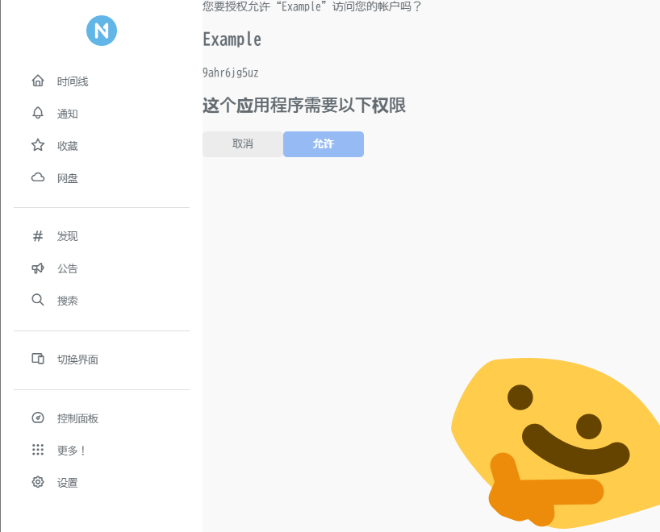

# Misskey 的授权模式

Misskey 有三种授权模式，分别是基于应用的 Auth 、临时授权的 MiAuth 和基于用户手动设置的 API Token 方式。

## 应用 Auth

该授权模式分为开发者创建应用和用户授权应用两部分。

### 开发者创建应用

使用的 API 地址为 `/api/app/create` 。

使用这个接口时无需验证，即任意开发者都可创建应用程序。

该接口为使用 `POST` 方式提交 `json` 数据，请注意设置请求头中的 `Content-Type` 为 `application/json` ，以避免 HTTP 415 错误。

该接口需要传入的请求体为：

```json
{
  "name": "应用的识别名",
  "description": "应用的描述",
  "permission": [
    "应用申请的权限"
  ],
  "callbackUrl": "应用授权后的回调地址"
}
```

其中 `callbackUrl` 可以不提供， `permission` 可以为空数组（表示不请求任何权限）。

::: info

具体可用的权限列表可以参考 [服务器的 OAuth2 信息](https://nya.one/.well-known/oauth-authorization-server) 里的 `scopes_supported` 部分。

:::

返回结果的格式也是 JSON ，格式如下：

```json
{
  "id": "应用的 ID",
  "name": "应用的识别名",
  "callbackUrl": "应用授权后的回调地址",
  "permission": [
    "应用申请的权限"
  ],
  "secret": "应用的私钥"
}
```

和请求体相比，少了应用描述，多了应用 id 和应用私钥。

返回体里的 `secret` 就是应用的私钥，在获取用户验证请求时需要使用这个参数来表明自己的身份，请妥善保管，避免泄露。

::: details 样例

例如，我们创建一个名为 `Example` 的应用程序，它的回调地址是 `http://localhost:3000` ，无需任何权限，那么这个请求体可以这样写：

```json
{
  "name": "Example",
  "description": "An example of application",
  "permission": [],
  "callbackUrl": "http://localhost:3000"
}
```

请求成功后，我们可以获取到这样的结果：

```json
{
  "id": "xxxxxxxxxxxx",
  "name": "Example",
  "callbackUrl": "http://localhost:3000",
  "permission": [],
  "secret": "xxxxxxxxxxxxxxxxxxxxxxxxxxxxxxxxx"
}
```

:::

::: danger 明文私钥

Misskey 会把这个私钥以明文的形式存储在数据库中，这是一个安全隐患。

但是鉴于 Misskey 没有提供修改 App 信息的 API 接口，或许如果只是丢失/泄露了私钥的话，直接去数据库里查询吧。

:::

::: tip 空权限

如果只是为了获取用户信息，我们建议您将 `permission` 设置为空数组，因为获取用户信息并不需要任何额外的权限。

:::

### 用户授权应用

这里分为四个步骤，即应用为用户提供授权会话跳转链接、用户通过链接确认授权、 Misskey 通过回调将用户授权传递到应用创建时指定的回调链接、应用端通过会话标识查询授权结果。

#### 1. 应用提供验证链接

使用的 API 地址为 `/api/auth/session/generate`

该接口为使用 `POST` 方式提交 `json` 数据，请注意设置请求头中的 `Content-Type` 为 `application/json` ，以避免 HTTP 415 错误。

该接口需要传入的请求体为：

```json
{
  "appSecret": "上一步创建的应用的私钥"
}
```

返回结果的格式也是 JSON ，格式如下：

```json
{
  "token": "验证请求的会话标识（UUID）",
  "url": "带有验证请求会话标识的完整链接"
}
```

这个 `token` 就是用于发起用户授权验证所需的唯一标识。

::: tip token 有什么用

因为 Misskey 在请求成功之后的回调数据里也会带有这个会话标识作为 query 查询参数，所以此处的会话标识可以用于辅助系统管理跳转前的状态，在 [MiSSO](/peripheral/misso/) 里有涉及。

或是用于没有回调的系统里去轮询 Misskey 授权状态的参数。

:::

::: details 样例

例如，我们使用刚刚创建的应用程序，请求一个授权会话：

```json
{
  "appSecret": "xxxxxxxxxxxxxxxxxxxxxxxxxxxxxxxxx"
}
```

请求成功后，我们可以获取到这样的结果：

```json
{
  "token": "uuuuuuuu-uuuu-iiii-dddd-dddddddddddd",
  "url": "https://nya.one/auth/uuuuuuuu-uuuu-iiii-dddd-dddddddddddd"
}
```

:::

#### 2. 用户确认授权

当应用获取到验证链接后，前端就可以将用户导向请求获得的 `url` 参数里指定的链接进行授权验证了。用户会看到一个~~支离破碎的~~授权界面，但应该能明白其想要表达的意思。

::: details 样例



:::

#### 3. Misskey 回调

当用户按下「允许」按钮后， Misskey 会带上这个会话的标识作为查询参数 `token` ，将用户导向应用创建时指定的回调链接，这是一个在用户前端发起的 `GET` 请求。

::: details 样例

例如按照我们上面定义的应用，回调时候会有这样一个链接的请求：

```
http://localhost:3000/?token=uuuuuuuu-uuuu-iiii-dddd-dddddddddddd
```

:::

#### 4. 查询结果

使用的 API 地址为 `/api/auth/session/userkey` 。

该接口为使用 `POST` 方式提交 `json` 数据，请注意设置请求头中的 `Content-Type` 为 `application/json` ，以避免 HTTP 415 错误。

该接口需要传入的请求体为：

```json
{
  "appSecret": "应用的私钥",
  "token": "验证请求的会话标识"
}
```

返回结果的格式也是 JSON 。

如果是针对回调方式调取用户数据的，那么通常情况下到了这一步可以直接获得访问令牌和用户信息。如果是轮询方式的，可能会出现请求错误提示。

返回的用户数据格式如下：

```json
{
  "accessToken": "用户的访问令牌",
  "user": { /* 用户的详细信息 Object */ }
}
```

::: warning 关于 用户的详细信息 Object

此处返回的 Object 与使用 `i` API 端点返回的数据结构可能不一致。出于数据稳定性考量，我们建议您以 `i` 端点的数据结构为准。

:::

可能出现的请求错误提示如下：

```json
{
  "error": {
    "message": "This session is not completed yet.",
    "code": "PENDING_SESSION",
    "id": "8c8a4145-02cc-4cca-8e66-29ba60445a8e",
    "kind": "client"
  }
}
```

返回体里的 `accessToken` 就是用户的访问令牌，也就是 API Token ，在与 Misskey API 交互时需要使用这个参数，请妥善保管，避免泄露。

::: details 样例

例如，我们使用刚刚创建的应用，发起一个请求：

```json
{
  "appSecret": "xxxxxxxxxxxxxxxxxxxxxxxxxxxxxxxxx",
  "token": "uuuuuuuu-uuuu-iiii-dddd-dddddddddddd"
}
```

获得了用户数据：

```json
{
  "accessToken": "foooooooooobaaaaaaaaaaaar",
  "user": { /* 用户的详细信息 Object */ }
}
```

:::

::: warning 会话管理

Misskey 的授权会话不带有过期机制，所以一个会话在得到授权之前会永远处于等待状态，拒绝也不会触发回调，并且因为 /api/auth/deny 这个端点被删了所以没法拒绝。

针对基于回调运行系统来说，没有回调并不会造成很大的影响；但针对轮询系统来说，请维护一套自己的授权会话生命周期管理系统，避免诸如一个请求卡两年的情况出现。

:::

## MiAuth

这部分可以参照 MisskeyHub 上的说明，此处不再赘述。

- 日文版： [アプリケーション利用者にアクセストークンの発行をリクエストする](https://misskey-hub.net/docs/api#アプリケーション利用者にアクセストークンの発行をリクエストする) 
- 英文版： [Request an access token to be issued](https://misskey-hub.net/en/docs/api#request-an-access-token-to-be-issued)

## API Token 手动授权

每一位用户都可以创建 API Token 以用于开发或是软件使用工作。您可在 **「设置」 - 「其他设置」 - 「API」** ( /settings/api ) 处创建与管理，并使用 API Console 功能测试各接口的调用。

此处您也可以管理使用另外两种方式授权的 Token ，虽然并看不出哪个 Token 都用在哪里（只有手动生成的带名称的才有，其他的不显示应用信息），只能靠猜了。

::: warning 安全提示

出于安全考虑，我们建议您依据以下三个原则管理 API Token：

1. 一个应用一个 Token ，应用销毁删除 Token
2. 最小化 Token 的权限，即仅保留需要的部分，禁止所有无关的权限
3. 定期检查您账号里的 Token ，及时删除掉所有陌生或不再使用的

:::

请保管好您的 API Token ，若有不慎遗失或是泄露，请立刻删除并重新生成。

## OAuth2

Misskey 自从 2023.9.0 版本引入了 OAuth2 认证系统以实现更强的兼容性。您可以在服务器的 [.well-known/oauth-authorization-server](https://nya.one/.well-known/oauth-authorization-server) 获取到关于这个 OAuth2 认证实现的全部信息，例如 授权端点、令牌获取端点、支持的权限项 等等。

但其本身具有许多局限：只能在调用时从目标客户端的前端页面拉取目标客户端的相关信息，而无法使用预先注册的应用。这条约束致使其使用场景受到了比较严重的限制。

喵窝修改的 OAuth2 实现了基于预先注册应用的兼容，并针对其进行相关请求参数进行针对性修改，从而完成了对诸如 Matrix 连接场景的兼容。以下流程描述均默认基于喵窝修改版的 OAuth2 实现。

::: details 如果您也想要修改版的 OAuth2 处理代码

您可以从 [nyaone/misskey](https://github.com/nyaone/misskey/blob/nyadev/packages/backend/src/server/oauth/OAuth2ProviderService.ts) 获得我们修改的代码，以进一步研究并适配给您的 Misskey 实例。

如果您有任何新想法，也欢迎您随时提出，促进开源生态进步。

:::

Misskey 的 OAuth2 使用强制的 PKCE 算法进行安全保证，加密算法为 S256 (SHA-256) 。在针对非注册应用的条件下需要保证客户端提供能被 Misskey 实例访问到的信息页面，已注册应用（即通过上文 [应用 Auth](#应用-Auth) 中描述的内容进行注册）依据下表进行参数对应：

| 应用 Auth   | OAuth2        | 备注       |
| ----------- | ------------- | ---------- |
| id          | client_id     |            |
| permission  | scope         |            |
| callbackUrl | redirect_uri  |            |
| secret      | client_secret | 暂时没有用 |

另外，这些参数必须为以下值：

| 参数                  | 值    |
| --------------------- | ----- |
| response_type         | code  |
| response_mode         | query |
| code_challenge_method | S256  |

为提高安全性，在使用返回的 Code 拉取到 API Token 后 5 分钟内如果再次尝试使用相同的 Code 拉取，会被认为是重放攻击而导致先前注册的 Token 失效。请避免上述情况的发生。

以使用 [OAuth 2.0 debugger](https://oauthdebugger.com/) 发出请求为例，一个可行的参数请求如下所示：

```txt
https://dev.nya.one/oauth/authorize
  ?client_id=9cscre9b4s
  &redirect_uri=https://oauthdebugger.com/debug
  &scope=read:account
  &response_type=code
  &response_mode=query
  &code_challenge_method=S256
  &code_challenge=ykFbXtcF7JlUplamfvRdLpLwikhhjLjdXhIbWVCWDJA
  &state=hnnwt8pu9g6
  &nonce=pizteimmht
```

需要注意的是，使用上述调试器时，您无法在前端获取最终的 Token ，因为 Token 获取端点并不是前端友好的，它的执行通常在后端进行，因此出于安全考虑并没有设置 CORS 请求头。

同时，当您使用预先注册的客户端进行注册调用时，我们限制了客户端能获取的 Token 数量，即当新的 Token 生成时就撤销旧的 Token ，以避免多 Token 导致给用户带来迷惑或是困扰。

当您拿到请求返回的 Token 后，由于 OAuth2 中定义的是使用 `Authorization: Bearer <token>` 进行授权，而 Misskey 的 API 不支持这种授权方式，您可以参照我们关于 Misskey API 的 [进阶的使用方式](../#进阶的使用方式) 中描述的内容执行相关的调用操作。
