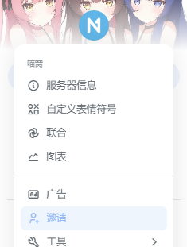
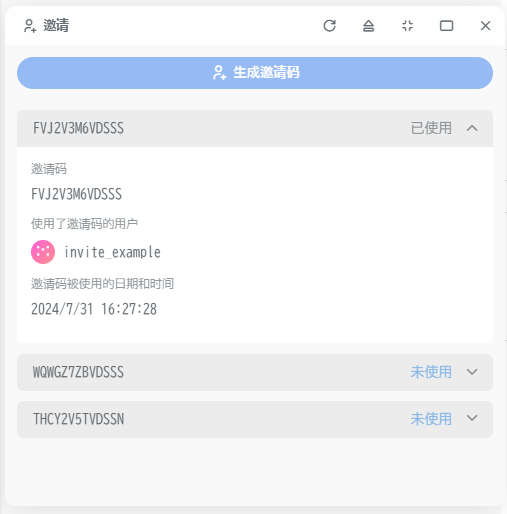

# 邀请

目前喵窝使用的是 Misskey 内置的邀请系统。

## 邀请码的生成

如果您已经获得邀请权限，您可以跟随以下步骤生成邀请码，以便分发给想要加入的用户。

1. 点击喵窝的站点标识，打开喵窝的站点菜单。 桌面用户在页面的左上角，手机用户在底栏从左往右数第一个按钮打开左侧边栏后的顶部。
   
2. 点击弹出菜单的 「邀请」 项，打开邀请码管理页面。您可以在此处 生成邀请码 和 管理已经生成的邀请码 。这里也会显示使用了您邀请码的用户。
   

## 邀请码使用限制

1. 您不得出于任何商业目的分发邀请码，包括但不仅限于销售、设置为您自己或您代表的组织牟利的获得门槛、设置邀请码作为无关活动的奖励等。
2. 为避免可能出现的滥用情况，请尽量避免在公开场合发布邀请码。
3. 请确保您信任被邀请的用户，如果您邀请的用户出现了违反站点规定的情况，视具体情况您可能也会受到相应的限制。

邀请规则的权限最终解释权归喵窝管理团队所有。
