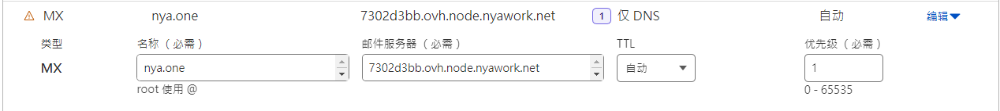

# 部署邮件系统

::: info

出于反滥用策略的考虑，该服务仅提供收件服务，不提供发件服务。如果您想部署带有发件服务的完整功能邮件服务器，我们推荐您使用 [MiSSO](/peripheral/misso/) 作为连接 Misskey 与目标服务器的身份认证中间件。

:::

## 项目仓库

您可以参见我们 GitHub 上的仓库：
  - [邮件在线预览](https://github.com/nyaone/readmail)
  - [核心处理程序](https://github.com/nyaone/email2misskey)

## 开发工作

### 技术栈

邮件在线预览： [React] + [TypeScript] + [TailwindCSS] + [NextJS]

核心处理程序： [Go] + [go-guerrilla] + [go-redis] + [zap]

[React]: https://reactjs.org/
[TypeScript]: https://www.typescriptlang.org/
[TailwindCSS]: https://tailwindcss.com/
[NextJS]: https://nextjs.org/

[Go]: https://go.dev/
[go-guerrilla]: https://github.com/flashmob/go-guerrilla/
[go-redis]: https://redis.uptrace.dev/
[zap]: https://github.com/uber-go/zap

### 二次开发

如果您对其中任何的代码感到不满意，或是想加入自己喜欢的部分，欢迎随时 fork 一份代码进行修改。

## 国际化（i18n）支持

因为该项目以喵窝私用为主，暂时没有相关支持的计划。如果您有兴趣研究其他语言的翻译与实现，我们也非常乐意一同研究国际化的支持。

## 工作流程

1. 作为 SMTP 服务器接收 25 端口入站邮件
2. 将邮件上传到 Misskey
3. 通过 Misskey 发送仅目标用户可见的帖子

## 准备工作

请先确认您目标服务器上的 TCP 协议入站 25 端口开启。我们提供了使用 docker 与 docker-compose 部署的方案供您参考使用，您也可以手动编译对应平台的二进制文件以是用其他方式执行。

### 部署邮件在线预览服务

这个使用的是 NextJS ，需要使用动态部署环境，具体内容请参见 [Deployment - Next.js](https://nextjs.org/docs/deployment) ，此处不再赘述。

### 获得一个 API 访问令牌

1. 前往您实例的 「设置 - 其他设置 - API」 ( /settings/api ) 
2. 单击 「生成访问令牌」 ，请启用 `查看账户信息`  `管理网盘文件` 和 `撰写或删除帖子` 项，其他的保持禁用状态
3. 给它取一个标识名（例如 `eMail to Misskey` ），单击右上角的钩子确认，在弹出窗口中复制您的 API 令牌

### 部署核心处理程序

1. 新建一个目录并进入
2. 复制 `docker-compose.yml` ，放置在您的目录中
3. 复制 `config.yml.example` ，重命名为 `config.yml` 并放置在您的目录中
4. 编辑 `config.yml`
   1. 将您的 Misskey 实例域名（例如 nya.one）写入 `misskey.instance` 字段
   2. 将上一步得到的 API 令牌写入 `misskey.token` 字段
   3. 如果您需要设置一个目录用于管理邮件（推荐），请将目录 ID 写入 `misskey.folderId` 字段
   4. 在 `email.host` 中设置您需要启用的收件地址域名（可以为多个），不属于该列表内域名的邮件都会被拒收
   5. 在 `email.readerUrl` 中设置您上一步部署的邮件在线预览服务，或者您也可以使用我们提供的公开服务链接
5. 使用 `docker-compose pull` 拉取容器镜像
6. 使用 `docker-compose up -d` 启动服务

### 设置域名 MX 解析

MX 解析表示使用指定的服务器处理发送至该域名的邮件，请于您的 DNS 解析服务商处填写您使用的服务器地址即可。

::: details 以 CloudFlare 作为 DNS 解析商为例

以喵窝使用的域名 nya.one 为例，您可以这样设置：

请注意 MX 解析指出的是 SMTP 服务所在的真实地址， CloudFlare 通常情况下并不会代理该端口（ TCP 25 ），所以该解析记录会被以明文形式呈现以供其他发件服务器查询，请注意可能出现的源站真实地址暴露问题。

:::

## 二次开发

您可以 fork 此项目以进行二次开发使用，请自行调整相关的设置内容。

## 调试

如有疑问，请检查上述步骤中是否存在疏漏的部分，如果依然无法解决，可以尝试将配置文件中的 `system.production`
 设置为 false ，以启用调试模式查看详细的日志。

如果您还是有疑问，您可以开启一个 issue ，附上您的完整复现流程，以获取更多帮助。
