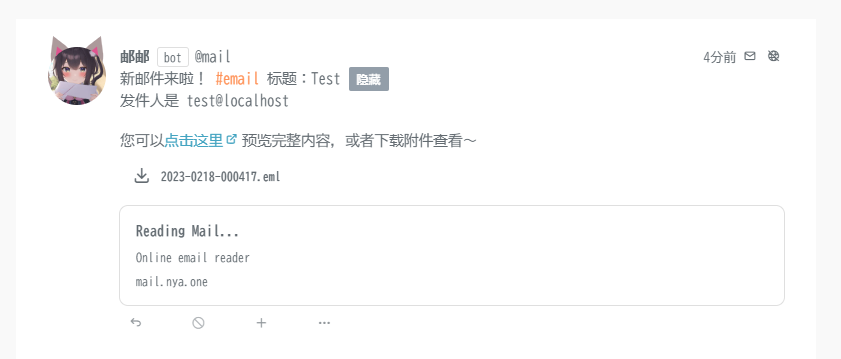

# 使用邮件系统

::: warning

该邮件系统的稳定性取决于多方面的因素，由于是单点+无存储的解决方案，稳定性无法和商业化的邮件服务相比，更多的是供您娱乐使用；且邮件本身不加密，并且为公开读取的权限设计，重要文件请**千万不要**通过该邮箱传输。

:::

当您在喵窝拥有账号时，您会自动获得一个 `您的id@nya.one` 的邮箱地址用于接收邮件，新邮件到来时您会收到一条形如下图的消息：

您可以通过我们提供的链接在线预览，或是点击附件下载邮件源文件查看。

预祝您使用愉快！
