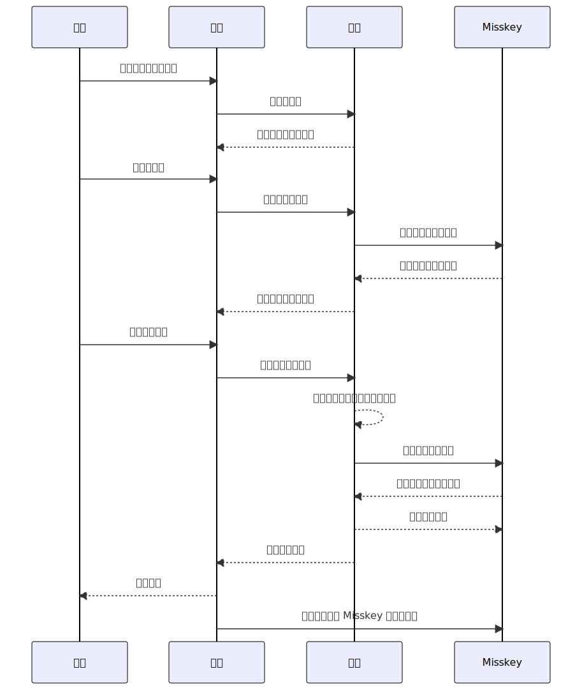
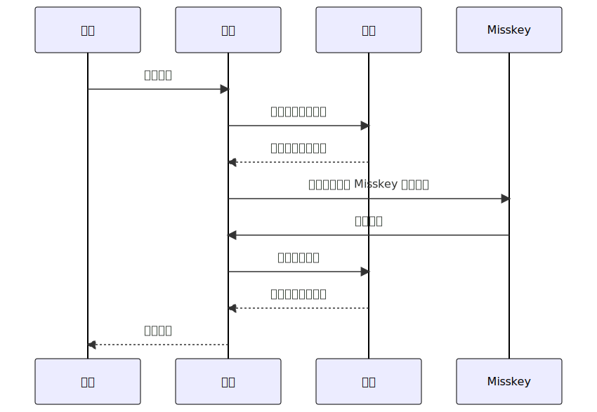
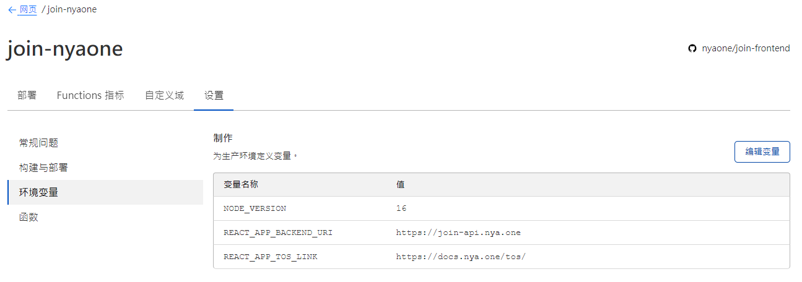

# 部署邀请管理系统

::: warning 项目已经归档

喵窝开放注册了，这个项目也正式宣布归档，此处的文档仅供如果需要实行类似半开放制的实例参考。

请注意我们不保证这个项目在未来也一直能用，如果遇到使用上的问题，您可能需要考虑二次开发。

:::

## 项目仓库

您可以参见我们 GitHub 上的仓库：
  - [前端](https://github.com/nyaone/join-frontend)
  - [后端](https://github.com/nyaone/join-backend)

## 开发工作

### 技术栈

前端： [React] + [TypeScript] + [TailwindCSS]

后端： [Go] + [Gin] + [GORM] + [go-redis] + [zap]

[React]: https://reactjs.org/
[TypeScript]: https://www.typescriptlang.org/
[TailwindCSS]: https://tailwindcss.com/

[Go]: https://go.dev/
[Gin]: https://gin-gonic.com/
[GORM]: https://gorm.io/
[go-redis]: https://redis.uptrace.dev/
[zap]: https://github.com/uber-go/zap

### 二次开发

如果您对其中任何的代码感到不满意，或是想加入自己喜欢的部分，欢迎随时 fork 一份代码进行修改。

特别地，如果您有自定义前端的需求，您可以参照 [src/common/api](https://github.com/nyaone/join-frontend/tree/master/src/common/api) 目录下的代码，其封装了与后端通讯相关的 API 接口，方便您使用。

## 国际化（i18n）支持

因为该项目以喵窝私用为主，暂时没有相关支持的计划。如果您有兴趣研究其他语言的翻译与实现，我们也非常乐意一同研究国际化的支持。

## 工作流程

### 新用户注册

该部分使用的是 [API Token 手动授权](/develop/peripheral/auth/#api-token-手动授权) 模式进行管理员和迎新消息发送的授权。

<div class="fillbg">

[](https://mermaid-js.github.io/mermaid-live-editor/edit#pako:eNqFVMtO20AU_ZVo1k4UJ7HjeJFVt6zYVd5Y8dBGJTYkttQ0iuTQB4YSMIIWBIiHSgJSJbsVVYMaWn9MPWPnLzp4QuQ869V47jn3nHNHMw1Q0hQIRFCD6wZUS_BZWX5RlSuSmiBfcHiLrV6yWERb7eCrKybQfde_3x5smKHbCy5boeMNjhxapAy6fmTYuxEDfzHxRWfEGKKiYjLWOPQO0en5CIaPXWR38dkW_mTNsRL-OUDvO3Qb2e2F8iNUePMu3Hk7ZqJYXCrXaq9gfQo8bWKITMYEqPEFnHlZF1CmsgZXTuhc47tb9GEn_NFFe705cdHe_sBsUcgQ7vbw940pK7NP56_Z-n-S2MDicsg6Rf1fcbkZ0_IfLicI2LLR9oXvXeGWO-lyUsfbxZ-_4Z_WDOj4bGn0oH-Az8_GJkWQNCCJHmGo_MQ0R7qDzTZyTpC9T0nh5t1TqITf76AHE9189H97pCqpgAEVWK3IZYXcpsZjRwnoL2EFSkAkSwWuyMaqLgFJbRKobOjacl0tAVGvGpABxpoi60-XD4gr8mqN7K7J6nNNG_sHYgO8BmKSY1NpLifw-byQZXmWzTKgDkRWyKUyPE8qOZ5jC9lMrsmAN1GLdKqQFtIcm88I-QwnZAsCA6BS1rXqEn0Booeg-Q_qGhQY)

</div>

### 管理员（已有的用户）登录

该部分使用的是 [应用 Auth](/develop/peripheral/auth/#应用-auth) 模式进行用户登录的授权。

<div class="fillbg">

[](https://mermaid-js.github.io/mermaid-live-editor/edit#pako:eNqNkj9PwkAYxr9K886F9A8t5QYmVyY306WhhxJpi6VNREIiMgAqiBFM_IcyaWICGAcGNHwZeoVvYelBAgOJN93d87vnfe7uLUHa0jEgKOATF5tpvJfVDm3NUE0mGH7ng9THkWTSazT9zyFi5sMx-brwHybeb5ciVFki7VaIkKuGd3NPEYrPpn1SGa7wkIpsWk473lNvJ7-2T2ULhWNcRMyi1vQGj177loab176ZlcaQxvu8f01adfJSpcdXykY5qgYV56PqjhvMft4W5xWaiHRHpDn4T3Z_ckd6z1s8NQ54GhUxK89627t8VU1gwcC2oWX14P1LyzMqOEfYwCqgYKrjjObmHBVUsxygmutY-0UzDcixXcyCm9c1Z_1dgDJarhDs5jXzwLK21oBKcAooIvFRToopcjyuiLzM8yILRUC8EosKshwoMVniE6IQK7NwFlpw0QSncBIfF5S4ICliQmEB61nHslO0Z8LWKf8BCpELIw)

</div>

## 准备工作

### 域名

因为该管理系统为前后端分离部署的设计，您需要准备两个域名（或子域名）用于完成用户请求。特别地，因为后端域名并不会在用户界面中表现出来，所以您如果需要注重域名的整洁度，您只需要为前端分配一个干净规整的域名即可。

例如，喵窝的管理系统使用的前端域名为 `join.nya.one` ，后端域名为 `join-api.nya.one` 。

请注意，由于开发时的便利考虑，不推荐您将服务部署在子目录下（可能会导致各种异常问题的出现），请使用根目录。

### 服务器

#### 前端

前端构建后为静态页面 [SPA](https://developer.mozilla.org/en-US/docs/Glossary/SPA) 项目，您可以自由部署在各种无服务器托管平台，如 CloudFlare Pages 、 GitHub Pages 或是 GitLab Pages 上。

如果您有自托管的需要，您也可以参照 [Deployment | Create React App](https://create-react-app.dev/docs/deployment/) 中的描述配置您自己的部署方式。

#### 后端

后端构建后为二进制格式的可执行文件，您可以自由部署在各种虚拟私有服务器（VPS）或是实体服务器（Dedicated Server）等平台上。

需要注意的是，一些传统的面板服务器可能不支持运行 Go 语言构建的这种可执行文件，请与您的服务商联系取得确认，避免产生误会导致相关工期的延误。

我们提供了基于 Docker 的容器镜像，以方便您的使用，您可以参考项目文档中给出的 `docker-compose.yml` 文件，使用 `ncr.pub/nyaone/join/backend` 镜像。

### 访问令牌

您可以参照 [API Token 手动授权](/develop/peripheral/auth/#api-token-手动授权) ，手动生成访问令牌。

- 用户的注册是通过调用管理员接口实现的，所以需要一个管理员权限的用户令牌；
  
  请注意 Moderator 权限并不足够，必须要是**实例管理员**权限；

  其中所有的权限都是不需要的，出于最小权限的安全考虑，我们推荐您保持所有权限为关闭状态；

- 发送迎新消息是通过调用贴文发送接口实现的，所以需要一个开启了 「撰写或删除帖子」 权限的普通用户令牌；

::: warning 身份隔离

管理员的身份并不会被公开，而迎新账号的身份无法隐藏，所以出于安全考虑，请分离两个令牌的提供者账号。

:::

## 参数配置

### 前端

前端主要的配置参数有两个，需要在**构建阶段**进行传入：

1. `REACT_APP_BACKEND_URI` 需要设置为指向您目标后端服务器的地址。

    例如在喵窝的部署方案中，我们设置为 `https://join-api.nya.one` 。
  
    请注意，该域名在被使用的时候会自动补充末尾的 `/` ，所以在设置域名参数时请避免末尾的斜线，以防止出现请求错误的问题。

2. `REACT_APP_TOS_LINK` 需要设置为指向您实例服务条款（Terms of Service）页面的链接。

    这个是在新用户注册时前端的提示，我们将它放在显眼的地方，并推荐用户阅读，以防止注册后再出现的问题。

    例如在喵窝的部署方案中，我们设置为 `https://docs.nya.one/tos/` 。

    这个域名并不会被用于请求，所以并不存在末尾斜线的问题。

例如，在 CloudFlare Pages 的服务上部署页面时，我们可以像这样设置环境变量：



### 后端

后端使用可执行文件同目录下的配置文件 `config.yml` 进行配置，这是一个 yaml 文件，相关的参数解释如下：

```yaml
frontend_uri: 指向前端页面所在网页的地址
system:
  debug: 是否开启调试模式，生产环境中请保持此项关闭
  postgres: 程式 Postgres 数据库的连接地址
  redis: 程式 Redis 数据库的连接地址
misskey:
  instance: 您的目标实例地址，暂时不支持使用内网链接
  token:
    admin: 管理员权限账号的访问令牌
    notify: 用于发送迎新消息的账号的访问令牌
```

项目仓库内提供了一个 `config.yml.example` 文件供您参考使用，如果您使用项目自带的 docker-compsoe 方式启动，那么您只需要调整 `frontend_uri` 和 `misskey` 块的配置为您指定的值即可。如果您使用的是其他部署方式，也可以参考该样例配置文件中相关的参数进行调整适配。

`frontend_uri` 出于与上文前端的后端地址配置中一样的原因，请带上 schema ，并避免末尾的斜线。

需要注意的是，这个 `misskey.instance` 的配置方式与其他应用并不相同，需要您带上 schema （如 https ），且暂时不支持内网访问（因为会用于注册成功后的跳转操作），请注意避免可能出现的因配置不正确导致程序无法正常工作的情况出现。

::: details 样例

喵窝部署时使用的参数指定如下：

```yaml
frontend_uri: "https://join.nya.one"
system:
  debug: false
  postgres: "postgres://nyaone:join+nya.1@db:5432/join"
  redis: "redis://redis:6379/0"
misskey:
  instance: "https://nya.one"
  token:
    admin: "xxxxxxxxxxxxxxxxxxxxxxxxxxxxxxxx"
    notify: "xxxxxxxxxxxxxxxxxxxxxxxxxxxxxxxx"
```

:::

## 部署与启动

### 前端

前端的部署此处不再赘述，您可以依据上文的描述选择您最喜欢的方案。

另外，由于前端使用的是基于路径的伪静态方式，请确保您的伪静态设置配置正确，以避免出现子页面无法加载的情况。

### 后端

我们提供了使用 Docker 与 Docker-Compose 进行部署的方案供您参考。

1. 上传 `docker-compose.yml` 和您配置完成的 `config.yml` 配置文件至工作目录中
2. 使用 `docker-compose pull` 命令拉取最新的镜像
3. 使用 `docker-compose up -d` 命令启动实例
4. 根据您的网页服务器需求，配置对应的反向代理规则。

::: tip 健康状况检查

如果您有检查后端运行状况的需求，您可以访问您后端实例的 `/healthcheck` 端点。

不过需要注意的是，在生产环境下，出于安全考虑，后端会禁止来自前端之外的请求数据，所以您需要在您的监控系统里配置请求时使用的 `Origin` 为您配置项中的 `frontend_uri` 相同的值，或者将 `403` 状态码作为可接受的值列入正常状态中。

:::

::: info 运行使用的端口

后端默认使用 Gin 自带的端口配置，也就是 8080 端口。但考虑到这个端口可能也会被其他服务占用，这里给出使用自定义端口的方案。

- 如果您使用 docker 容器启动，且工作在非 host 网络上，那么只需要修改向外映射的端口号就可以。

- 如果您使用二进制模式启动，或是让容器工作在 host 网络上，您可以通过指定环境变量 `PORT` 为您需要的端口号，来让 Gin 工作在您指定的端口上。

:::

## 反向代理配置

根据您使用的前端部署系统的不同，前端的反向代理也并不一致，因而此处只针对后端的反向代理进行大致描述。

我们使用的后端反向代理工具为手动配置的 nginx ，配置文件如下：

```
upstream join-be {
    # Join NyaOne
    server 127.0.0.1:8080;
    keepalive 64;
}

server {
    # nginx listens to this
    listen 443 ssl http2;

    # the virtual host name of this
    server_name join-api.nya.one;

    ssl_certificate     /etc/nginx/ssl/nyaone/cert.pem;
    ssl_certificate_key /etc/nginx/ssl/nyaone/key.pem;

    # Cloudflare Pull-authenticate
    ssl_client_certificate /etc/nginx/ssl/cf-pull.pem;
    ssl_verify_client on;

    location / {
        proxy_pass http://join-be;
        include conf.d/shared/revproxy.conf;
    }
}
```

其中 `conf.d/shared/revproxy.conf` 为：

```
proxy_http_version 1.1;
proxy_cache_bypass $http_upgrade;
proxy_set_header   Upgrade             $http_upgrade;
proxy_set_header   Connection          "upgrade";
proxy_set_header   Host                $host;
proxy_set_header   X-Real-IP           $remote_addr;
proxy_set_header   X-Forwarded-For     $proxy_add_x_forwarded_for;
proxy_set_header   X-Forwarded-Proto   $scheme;
proxy_set_header   X-Forwarded-Host    $host;
proxy_set_header   X-Forwarded-Port    $server_port;
```

## 调试模式与日志

您可能注意到了配置项中 `system.debug` 项，该选项在设置为 `true` 时可以开启调试模式，此时会输出所有的日志，并开放来自任意客户端的连接（即 CORS 允许所有）方便调试使用；在生产环境中请确保该选项设置为 `false` ，以避免服务器遭受恶意攻击等情况发生。
