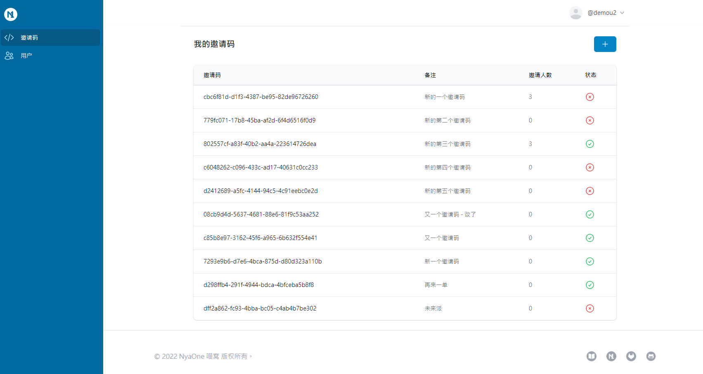
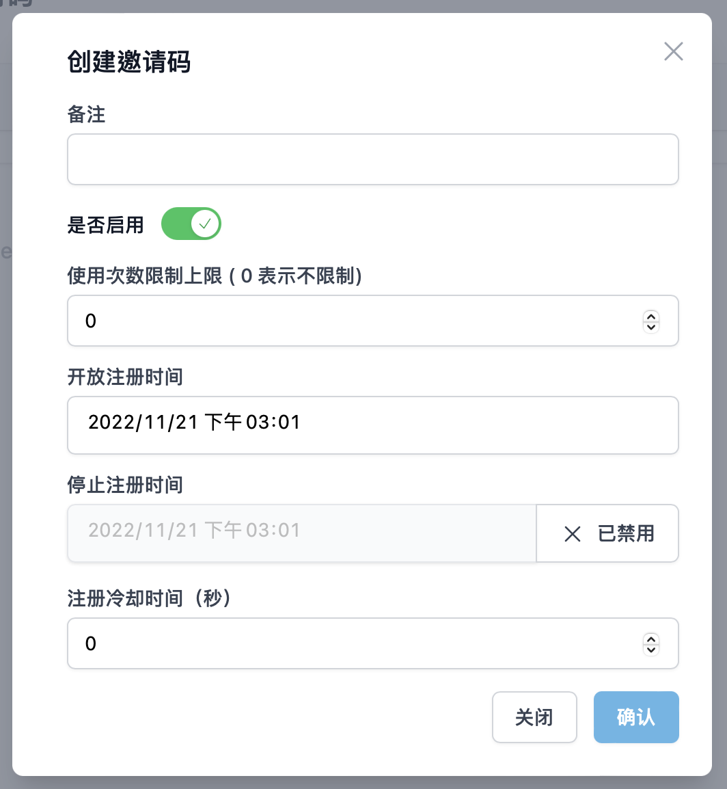
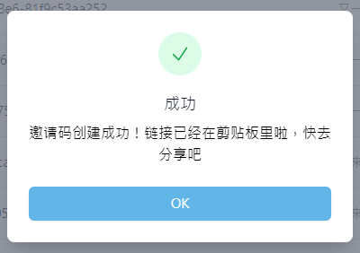
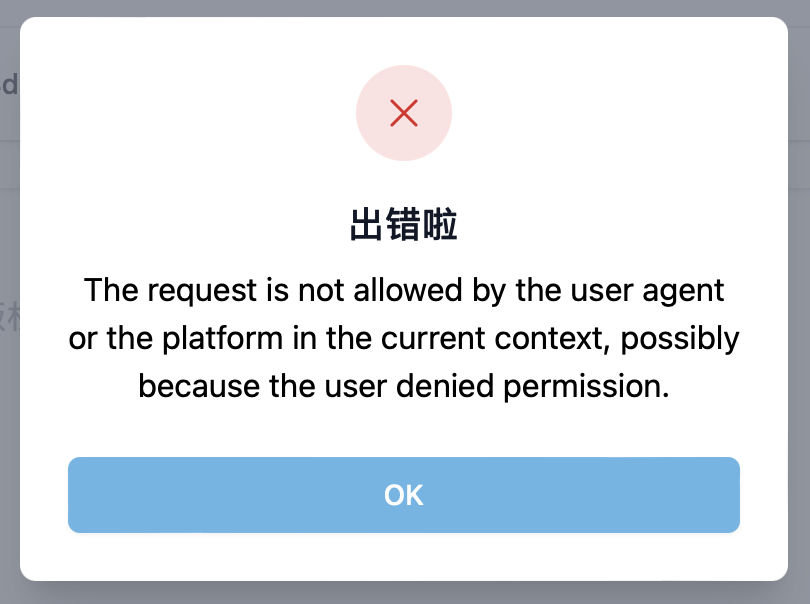
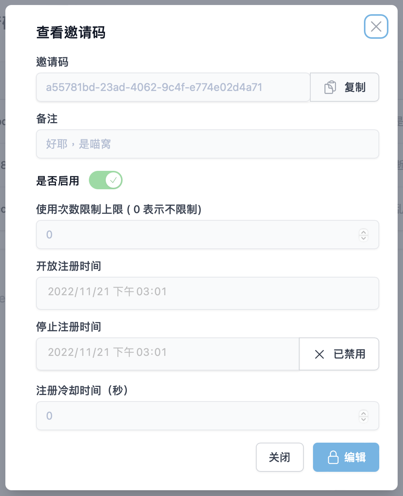
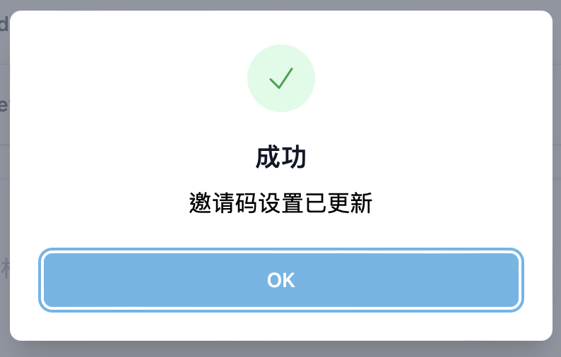
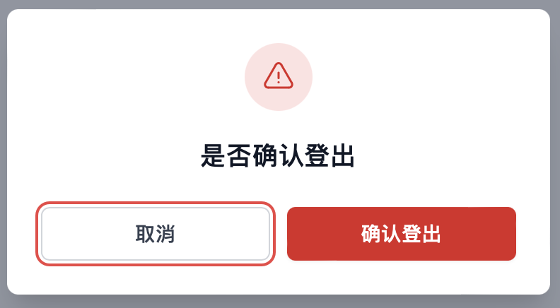

# 使用邀请管理系统

::: warning 项目已经归档

喵窝开放注册了，这个项目也正式宣布归档，此处的文档仅供如果需要实行类似半开放制的实例参考。

请注意我们不保证这个项目在未来也一直能用，如果遇到使用上的问题，您可能需要考虑二次开发。

:::

## 使用限制

每一位喵窝用户在遵守合理使用规约的前提下，都有权自由使用该邀请管理系统。

为避免出现不可控的链式反应，系统限制了新注册 24 小时内用户的使用，请先享受一天的生活，再考虑考虑要不要邀请更多的伙伴加入。

## 注意事项

请注意辨明服务的链接。出于安全因素考虑，当您作为管理员身份使用时系统不会需要您输入任何的敏感信息（包括但不仅限于您的邮箱、您的密码、您的 API Token 等），如有类似情况出现那一定是仿冒的信息盗取工具，请注意自我保护。

::: warning 安全建议

我们建议您不要在任何公开场合发布邀请码或是包含邀请码的链接，并注意对可能涉及范围较大的邀请链接进行时间限制，以避免出现潜在的泄露或是被他人利用导致的攻击情况发生。

如果邀请码遭到滥用，我们保留禁用邀请码及对相关账号进行安全评定的权利。

:::

## 使用教程

1. 请确认您的互联网连接状况良好，且浏览器启用了 JavaScript 支持。

2. 访问 [join.nya.one](https://join.nya.one) 以开启邀请管理系统的前端界面。

3. 单击右上角的 「登录」 按钮以跳转至喵窝执行授权登录操作。

4. 在弹出的页面中，请检查应用程序申请的权限。出于安全因素考虑，邀请管理系统**无需授权任何权限**。确认无误后，请单击“允许”按钮以进行跳转。
    

5. 您会被导向登录跳转页面。如果提示会话不存在等错误信息，系统会将您导向首页，此时您可以从第 3 步继续。

6. 确认完成后，您会被导向形如下图的管理界面。

    - 请注意如果您没有创建邀请码，那么会有提示文本，没有表格。
    - 您可以单击表格右上角 「+」 按钮创建新的邀请码，在弹出的界面中编辑邀请码相关的设置。

    

7. 您可以在弹出界面中编辑邀请码相关的设置。
    目前的配置项参数如下：

    - **备注**是为了方便您管理设计的参数，该参数不会被透露给被邀请者。
    - **是否启用**表示此邀请码是否可用，如果某个邀请码遭到滥用您可以快速暂停其使用。
    - **使用次数上限**表示是否规定该邀请码的使用次数，设置为 0 表示不做限制，可以使用在需要限制使用人数的场合。请注意该限制并非严格限制，当用户请求过于接近时可能会出现注册人数超出限制的情况。
    - **开放注册时间**表示从什么时候开始允许邀请码的使用，可以用在定时开放的场合。该项会被默认为打开邀请码管理页面的时间，即创建后立刻可以开始使用。请注意目前不支持设置周期事件。
    - **停止注册时间**表示从什么时候开始禁止邀请码的使用，可以用在定时结束的场合，右边的按钮可以切换该参数是否被启用。不被启用（已禁用）时，该项设置不会对邀请码的有效性造成影响。
    - **注册冷却时间**（秒）表示每当有一名用户使用该邀请码注册成功时，后一名注册尝试的用户需要等待多少时间（计量单位为秒）才可以继续进行注册。请注意该限制并非严格限制，当用户请求过于接近时可能会出现冷却失效的情况。
    
    以上配置参数均可组合使用，当邀请码符合其中任何一项限制时都会被标记为失效，即不可被用于注册。

    

8. 单击右下角的 「确认」 按钮以确认邀请码的生成，随后您可在 “我的邀请码” 列表中查看到刚刚生成的这条邀请码。

    

    此时系统会自动将生成的邀请链接复制到您的剪贴板中，但在部分系统上由于剪贴板权限的限制，邀请码并不会被自动复制，而是会提示如下图所示的出错信息。但只要在邀请码列表中出现了，那么邀请码依然是创建成功的，可以不用担心。

    

9. 单击列表中的邀请码，您可以进入邀请码的详细信息界面，此时您可以查看创建邀请码时设置的配置参数信息，在顶部可以查看邀请码，单击右边的复制可以复制包含邀请码的链接，方便直接粘贴使用。

    

10. 为避免误操作，默认状态下该面板为只读模式。单击右下角的 「编辑」 按钮，您可以解锁邀请码的设置以进行相关的编辑工作。您可以编辑邀请码相关的参数信息，具体配置项与创建时的一致，此处不予赘述。

    请注意邀请码本身是不能被编辑的，这是设计时就考虑的安全因素之一。它是伴随着邀请码的生成自动产生的一串 UUID 。

    编辑成功后您会看到如下图所示的成功提示。请注意此时邀请码不会被自动复制，如有分享需求，您需要点击进入上一步中的详细信息界面以快速复制。

    

11. 针对每一条验证码，您可以通过表格最后一列的“状态”来快速查看其是否有效。单击该列中的对应行内容还可以查看验证码具体的失效原因，如手动禁用、超出人数限制、超出时限、正在冷却中等参数内容。请注意目前的提示信息为后端返回的英文，如果您没法理解其中的含义，您可以使用翻译软件加以辅助（其实也不重要啦）。

12. 单击左侧侧边栏的“用户”项，您可以查看到所有您邀请的用户，和其的注册时间及使用的邀请码。如果您没有邀请任何用户，那么该表格也会为空。单击用户列表中的任意一项即可跳转至该用户在目标实例上的用户页面，方便快速查看。

    

13. 当您完成所有管理工作后，您可以单击页面右上角的头像部分，选择如下图所示的“退出登录”以执行退出登录操作。

    

    为避免误操作，系统会弹出一个如下图所示的消息提示框来提示您是否确认登出。当您单击 「确认登出」 按钮退出登录后，您会被导向首页。

    

预祝您使用愉快！
