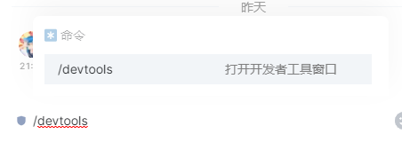
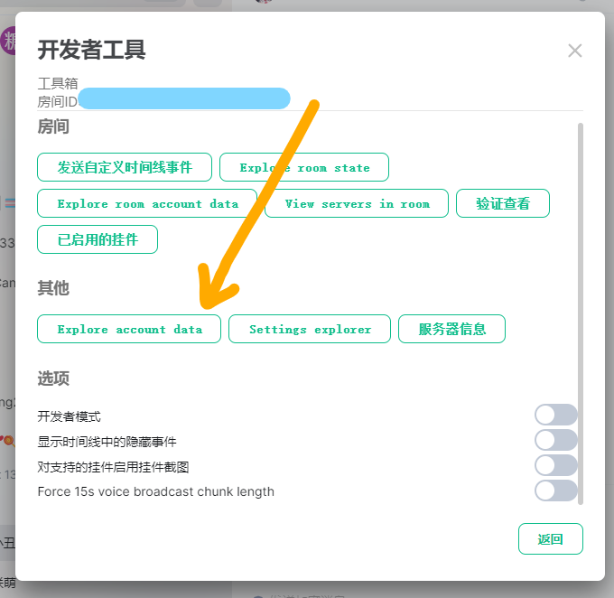
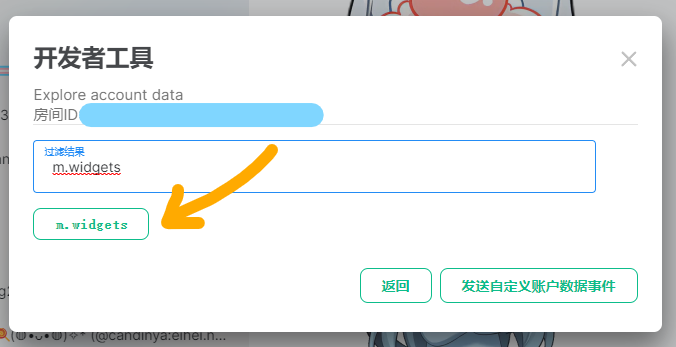
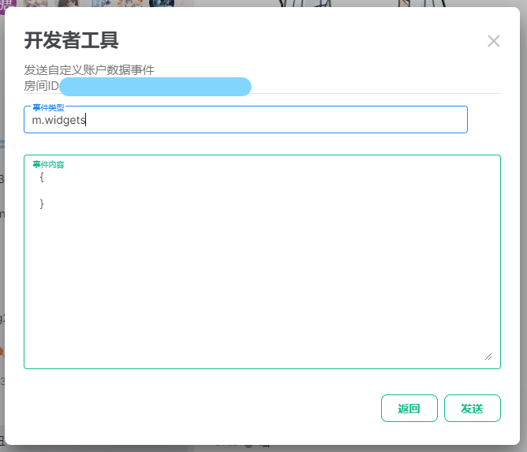
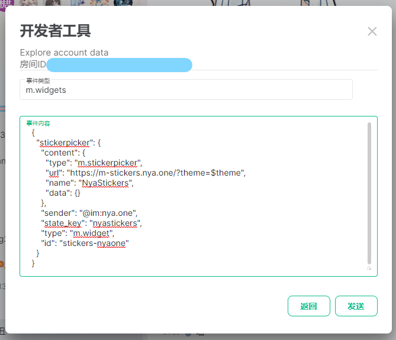
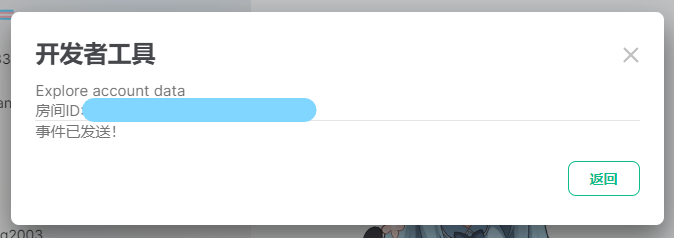
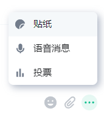
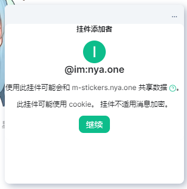
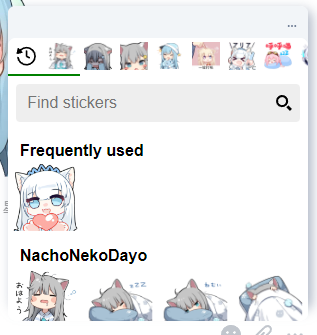

# 喵窝 Matrix 的贴图包

## 说明

喵窝有搭建一个[基于 stickerpicker 的表贴图包仓库](https://github.com/nyaone/stickerpicker)，里面放置了一些可供使用的表情包。

用这个方式设置的贴纸可以在各个平台上使用，不用担心跨平台的兼容问题。

## 使用方法

您可以参照以下的流程来启用（此处以桌面版的 Element 为例）：

1. 在任何一个聊天界面的输入框内，输入 `/devtools` ，按下发送键以启动开发者工具

    

2. 单击「其他」选项里的「Explore account data」（未来翻译可能会变化），打开账号信息管理工具。

    

3. 在打开的界面中搜索 `m.widgets` ，单击匹配的搜索结果，以进入挂件编辑页面。

    

    如果您的搜索结果中没有出现匹配的块，您可以单击右下角的「发送自定义账户数据事件」，并在「事件类型」中输入 `m.widgets` 。

    

4. 单击右下角的「编辑」按钮以解锁事件编辑，在「事件内容」中粘贴如下代码：

    ``` json
    {
      "stickerpicker": {
        "content": {
          "type": "m.stickerpicker",
          "url": "https://m-stickers.nya.one/?theme=$theme",
          "name": "NyaStickers",
          "data": {}
        },
        "sender": "@im:nya.one",
        "state_key": "nyastickers",
        "type": "m.widget",
        "id": "stickers-nyaone"
      }
    }
    ```

    

5. 单击右下角的「发送」以确认，您会收到如图所示的提示信息：

    

6. 单击聊天界面右下角的更多功能，选择弹出菜单的「贴纸」

    

7. 阅读弹出窗口中的详细说明，确认无误后单击「继续」。

    

8. 您可以在加载出来的页面中选择具体的贴纸，使用愉快！

    

## 注意事项

1. 在其他 Matrix 服务器上也可以使用喵窝的贴纸，同样您也可以在喵窝的服务器上使用其他服务器（例如您自己搭建的服务器）的贴纸。
2. 这些贴纸均为从 Telegram 搬运所得，具体版权归贴纸版权持有方所有，喵窝此处的仅是搬运使用权，并不对任何与版权相关的内容负责。如对贴纸的版权有疑虑，请 [联系我们](/contact/) 。

## 贴纸速览

<iframe src="https://m-stickers.nya.one" style="width: 300px; height: 300px;"></iframe>
