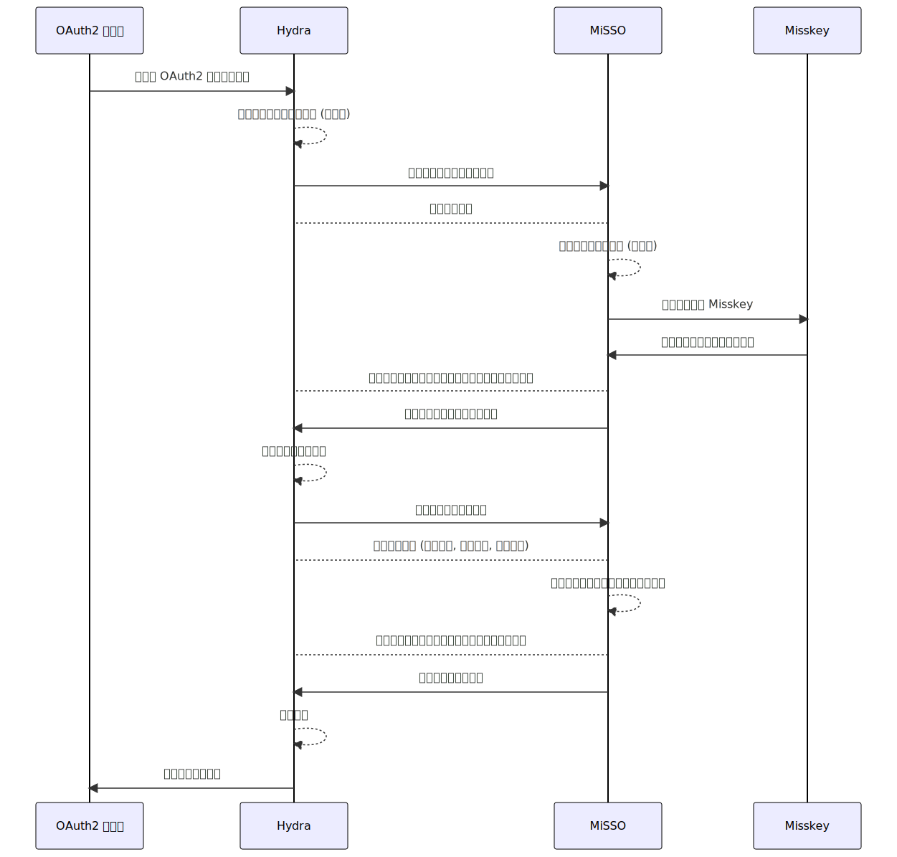

# 部署 MiSSO

## 项目仓库

您可以参见我们 GitHub 上的仓库： [MiSSO - GitHub](https://github.com/nyaone/misso)

## 开发工作

### 技术栈

本体的开发使用的是 [Go] + [Gin] + [go-redis] + [zap]

另外引入了 [Hydra] 作为 OAuth2 管理核心。

[Go]: https://go.dev/
[Gin]: https://gin-gonic.com/
[go-redis]: https://redis.uptrace.dev/
[zap]: https://github.com/uber-go/zap

[Hydra]: https://www.ory.sh/hydra/

### 二次开发

如果您对其中任何的代码感到不满意，或是想加入自己喜欢的部分，欢迎随时 fork 一份代码进行修改。

::: warning 目前存在的问题

1. 现在 MiSSO 里对 Misskey 用户的定义是直接写了一个严格定义的结构体，但这样会让程序的兼容性下降，在 Misskey 用户结构出现变更后可能会导致工作不正常等问题的发生。这边想要让除了明确需要使用的字段定义外同时在 json marshall 时保留其他内容，以方便其他应用访问时获取完整的用户信息，尝试了让 Go 隐式包含 interface{} 、 map[string]interface{} 都没法用，不确定有没有什么好的办法，还是说只能定义成 map[string]interface{} 的结构，再用类型不安全的方式去处理。
2. 现在的 MiSSO 对登录状态的管理没有一个较好的方法，解决方案比较妥协折中（记住，但是只记住 10 分钟），不知道有没有什么更好的思路。
3. 现在的一些时间参数都是硬编码进程序的，以后也许会开放通过配置项修改。

:::

## 国际化（i18n）支持

因为该项目以喵窝私用为主，暂时没有相关支持的计划。如果您有兴趣研究其他语言的翻译与实现，我们也非常乐意一同研究国际化的支持。

## 工作流程

[](https://mermaid-js.github.io/mermaid-live-editor/edit#pako:eNqVVF1v0lAY_ivNuXJJIZTP0gsSEy-8WXbBneGmoZ0jDpjQJiIhEZ1ZJ5-GDQOCDuMmQUOji_vqPv5Mz2n7Lzz00FEYzshVy_s-z_u8z3N6iiCZFUTAgbz4XBYzSfFRin-a49OJDIV_aw9lacNPwfEXpJwa31VPLPa4IOR4joJKH36rwGrb6UF1BfXfGAdlpLStbhP9LhMKu98zA6JfA9TbhQ3V2Bsa3W1DUzAvfsYD9MuuqfapB6g3ImwrbopYbDUVj69xlLVTg-MubL53Y82dY6Ojwat941gztM8EaAPwbGd0Bc9tkzb9ZoDK6nybM2BBIpFFAHfFEfAEm88_EwtueY4walpzAPbLbBw8O9LP3pnjG-vDWNe-GrvVpRsuXWnW6doKnp_olwfmdQsz40VIyRpVTbUMO5ONblFW6xrVD-cXucPs0gDr2gLb8pBvD4x11EY_BqZ6in6-xp5ZneY_InU8g80q2m6YgyGs7d8TJmlzsoGtkX5VIxw0pWuv9HPFGFbgRYOmJrWLj0TDyvLciUz3vtgr-LZsjs9Q_3B6wG06EtZSXVPnbV2G1kKfejgObDLaOyFxkBIx8H-zwP674X_1n5SJ4nnDF79oR7D78yWHENAgLebSfErAt0NxwpIA0oaYFhOAw4-CuM7Lm1ICJDIl3MrLUjZeyCQBJ-VkkQbylsBLzmUCuHV-M4__3eIzT7LZuXfAFcELwHlCjNcXCrLhSIQNMGGGCdCgADiGDXr94TCuBMMhJhrwB0s0eGlT-LxRH-sLMRE_G_GH2ECUpYEopKRsbpXcaPbFVvoDBf5wDA)

## 工作原理

> 主要参考了 [hydra-login-consent-node](https://github.com/ory/hydra-login-consent-node) 这个样例项目

OAuth2 相关的管理都是 Hydra 在负责， MiSSO 本体仅处理 4 种请求：

1. 用户登录
2. 用户同意信息授权
3. 第三方应用获取用户信息
4. 第三方应用登出

其中针对用户登录和第三方应用登出的请求进行了简化，即直接默认用户记住登录状态、用户确认登出。

在用户登录处，使用了 Misskey 的 [应用 Auth](/develop/peripheral/auth/#应用-auth) 授权模式。

## 准备工作

### 域名

因为该连接系统需要让用户来回跳转，您需要准备一个域名用于完成用户请求。

这个域名会被前端表现出来，如果需要注重域名的整洁度，您需要分配一个干净规整的域名。

例如，喵窝的 MiSSO 部署使用的域名是 `sso.nya.one` 。

严格来讲，您将 MiSSO 与 Hydra 分别放置在不同的域名下也没有问题，但是考虑到单个域名可以复用连接带来的性能优势，且其本身功能一体、路由不冲突，部署在一起或许是一种不错的方案。

请注意，由于开发时的便利考虑，不推荐您将服务部署在子目录下（可能会导致各种异常问题的出现），请使用根目录。

### 服务器

MiSSO 构建后为二进制格式的可执行文件，您可以自由部署在各种虚拟私有服务器（VPS）或是实体服务器（Dedicated Server）等平台上。

需要注意的是，一些传统的面板服务器可能不支持运行 Go 语言构建的这种可执行文件，请与您的服务商联系取得确认，避免产生误会导致相关工期的延误。

我们提供了基于 Docker 的容器镜像，以方便您的使用，您可以参考项目文档中给出的 `docker-compose.yml` 文件，使用 `ncr.pub/nyaone/misso` 镜像。

### Misskey 应用

您需要参照 [开发者创建应用](/develop/peripheral/auth/#开发者创建应用) 中描述的步骤，创建一个应用并记录下它的应用私钥，以从 Misskey 获得授权的用户信息。

其中， `callbackUrl` 请设置成 MiSSO 的 `/misskey` 路径。

::: details 样例

喵窝创建的应用请求体如下：

```json
{
    "name": "MiSSO",
    "description": "使用 Misskey 来一键登录",
    "callbackUrl": "https://sso.nya.one/misskey",
    "permission": []
}
```

:::

## 参数配置

在仓库的 .config 目录下提供了针对 Hydra 和 MiSSO 的配置样例，可供您参考使用。

### Hydra

Hydra 具体的配置参数请参见 [Configuration | Ory](https://www.ory.sh/docs/hydra/reference/configuration) ，此处的描述可能会存在时效性问题，因而不再赘述。

需要注意的是 `urls` 部分的配置，需要指向您生产环境中具体使用的域名及路径，其中生产环境下的 `self.issuer` 要求使用 https 协议以确保安全。

```yaml
urls:
  self:
    issuer: Hydra 自己
  consent: MiSSO 的 /consent
  login: MiSSO 的 /login
  logout: MiSSO 的 /logout
```

::: details 样例

喵窝部署时使用的参数指定如下：

```yaml
dsn: "postgres://nyaone:misso+nya.1@db:5432/hydra?sslmode=disable&max_conns=20&max_idle_conns=4"

serve:
  cookies:
    same_site_mode: Strict

urls:
  self:
    issuer: https://sso.nya.one/
  consent: https://sso.nya.one/consent
  login: https://sso.nya.one/login
  logout: https://sso.nya.one/logout

secrets:
  system:
    - "xxxxxxxxxxxxxxxxxxxxxx"
```

:::

### MiSSO

MiSSO 的配置参数解释如下：

```yaml
system:
  debug: 是否开启调试模式，生产环境中请保持此项关闭
  redis: 程式 Redis 数据库的连接地址
misskey:
  instance: 您的目标实例地址，请使用公开域名
  application:
    secret: Misskey 应用的私钥
hydra:
  admin_url: 指向 Hydra 的 Admin 端口的链接
```

其中 `misskey.instance` 与[邀请管理系统](/peripheral/join/)的参数并不相同！这个参数**不能**包含 schema 头，因为它会被用作生成用户邮箱的域名部分。另外，这个邮箱可以使用 [email2misskey](/peripheral/email/) 来让其真的有效。

::: details 样例

喵窝部署时使用的参数指定如下：

```yaml
system:
  debug: false
  redis: "redis://redis:6379/0"
misskey:
  instance: "nya.one"
  application:
    secret: "xxxxxxxxxxxxxxxxxxxxxxxxxxxxxxxx"
hydra:
  admin_url: "http://hydra:4445"
```

:::

## 部署与启动

我们提供了使用 Docker 与 Docker-Compose 进行部署的方案供您参考。

1. 上传 `docker-compose.yml` 与您配置完成的 `hydra.yml` 和 `misso.yml` 配置文件至工作目录中
2. 调整 `docker-compose.yml` 文件中的卷映射，确保宿主机内的配置文件位置正确（例如在 .config 目录下，或是自行调整）
3. 使用 `docker-compose pull` 命令拉取最新的镜像
4. 使用 `docker-compose up -d` 命令启动实例
5. 根据您的网页服务器需求，配置对应的反向代理规则。

::: tip 健康状况检查

MiSSO 有自己的健康状况检查端点 `/healthcheck` ， Hydra 也有自己的 `/health/ready` ，您可能需要分别设置健康监控。

:::

::: info MiSSO 运行使用的端口

MiSSO 默认使用 Gin 自带的端口配置，也就是 8080 端口。但考虑到这个端口可能也会被其他服务占用，这里给出使用自定义端口的方案。

- 如果您使用 docker 容器启动，且工作在非 host 网络上，那么只需要修改向外映射的端口号就可以。

- 如果您使用二进制模式启动，或是让容器工作在 host 网络上，您可以通过指定环境变量 `PORT` 为您需要的端口号，来让 Gin 工作在您指定的端口上。

:::

::: info MiSSO 的配置文件位置

MiSSO 默认会尝试读取当前工作目录下的 `config.yml` 作为配置文件。

如果您使用二进制方式运行，且的配置文件并不在当前工作目录下，您可以使用 `CONFIG_FILE_PATH` 这个环境变量来指定目标配置文件的位置。

如果您使用我们提供的 `docker-compose` 方式运行，那么不需要做其他的调整，我们已经将目录映射过去了。

:::

## 反向代理配置

喵窝在部署时是将 MiSSO 与 Hydra 部署在同一域名下的，以保证用户不会被来回跳转影响体验。喵窝使用的 Web 服务器是 nginx ，配置文件如下，可以供您参考使用：

```
upstream misso_backend {
    server 127.0.0.1:8080;
    keepalive 64;
}

upstream hydra_public_backend {
    server 127.0.0.1:4444;
    keepalive 64;
}

server {
    # nginx listens to this
    listen 443 ssl http2;

    # the virtual host name of this
    server_name sso.nya.one;

    ssl_certificate     /etc/nginx/ssl/nyaone/cert.pem;
    ssl_certificate_key /etc/nginx/ssl/nyaone/key.pem;

    # Cloudflare Pull-authenticate
    ssl_client_certificate /etc/nginx/ssl/cf-pull.pem;
    ssl_verify_client on;

  ## MiSSO

    location / {
        proxy_pass http://misso_backend;

        include conf.d/shared/revproxy.conf;
        proxy_store off;
    }

  ## Hydra

    location ~* ^(\/.well-known|\/oauth2|\/health\/) {
        proxy_pass http://hydra_public_backend;

        include conf.d/shared/revproxy.conf;
        proxy_store off;
    }

}

```

其中 `conf.d/shared/revproxy.conf` 为：

```
proxy_http_version 1.1;
proxy_cache_bypass $http_upgrade;
proxy_set_header   Upgrade             $http_upgrade;
proxy_set_header   Connection          "upgrade";
proxy_set_header   Host                $host;
proxy_set_header   X-Real-IP           $remote_addr;
proxy_set_header   X-Forwarded-For     $proxy_add_x_forwarded_for;
proxy_set_header   X-Forwarded-Proto   $scheme;
proxy_set_header   X-Forwarded-Host    $host;
proxy_set_header   X-Forwarded-Port    $server_port;
```

## OAuth2 客户端创建

该部分属于 Hydra 的 API 范围，这里只做简单介绍，具体的细节信息请参照 [Create OAuth 2.0 Client](https://www.ory.sh/docs/hydra/reference/api#tag/oAuth2/operation/createOAuth2Client) 中的描述。

首先，我们需要能访问到 Hydra 的 admin API 。默认配置下 admin API 工作在 4445 端口，而我们的 docker-compsoe.yml 文件中出于安全因素的考虑，并没有暴露这个端口。所以我们调整 `hydra` 的 `ports` 段，增加 `"4445:4445"` 的端口映射选项，使其暂时暴露在公网环境下以便操作。

::: danger 暴露在公网

这是一个极其危险的做法，此处只是为了偷懒。

1. 一种更为推荐的做法是使用 `"127.0.0.1:4445:4445"` 的内网映射选项，仅接收来自本机的请求，然后使用命令行请求发送数据。
2. 另一种更更推荐的做法是不暴露端口，而是使用 `docker-compose exec hydra sh` 直接进入容器执行操作。容器中有 wget 可以使用。
3. 但我实在太懒了。

:::

::: tip センパーセントの安全

Hydra 在启动时候可以[指定其工作模式](https://www.ory.sh/docs/hydra/cli/hydra-serve)，默认提供的 `serve all` 表示同时开启 `admin` 和 `public` 端口的监听。

如果您使用的是分布式系统的方案（即通过共享数据库在多个 Hydra 之间同步数据），设置公开节点的启动命令为 `serve public` 能彻底关闭 admin 模式的端口。对于连接 MiSSO 使用的 Hydra ，则可以设置 `serve admin` 来关闭不必要的 public 端口。

像喵窝这样单点式部署的话就还是算了。

:::

当端口打开后，我们就可以创建客户端了。

使用的 API 地址为 `/admin/clients` ，该接口为使用 `POST` 方式提交 `json` 数据。

例如，我们创建一个用于给 Matrix 使用的客户端（其中的 `scope` 就是我随手写的一个值，这个值具体由应用的实际使用场景来定义）：

```json
{
    "client_name": "Matrix",
    "scope": "read:accounts",
    "redirect_uris": [
        "https://matrix.nya.one/_synapse/client/oidc/callback"
    ]
}
```

可以得到如下的返回结果：

```json
{
    "client_id": "uuuuuuuu-uuuu-iiii-dddd-dddddddddddd",
    "client_name": "Matrix",
    "client_secret": "xxxxxxxxxxxxxxxxxxxxxxxxxx",
    "redirect_uris": [
        "https://matrix.nya.one/_synapse/client/oidc/callback"
    ],
    "grant_types": null,
    "response_types": null,
    "scope": "read:accounts",
    "audience": [],
    "owner": "",
    "policy_uri": "",
    "allowed_cors_origins": [],
    "tos_uri": "",
    "client_uri": "",
    "logo_uri": "",
    "contacts": null,
    "client_secret_expires_at": 0,
    "subject_type": "public",
    "jwks": {},
    "token_endpoint_auth_method": "client_secret_basic",
    "userinfo_signed_response_alg": "none",
    "created_at": "2023-01-25T03:54:59Z",
    "updated_at": "2023-01-25T03:54:58.593996Z",
    "metadata": {},
    "registration_access_token": "ory_at_xxxxxxxxxxxxxxxxxxxxxxxxxxxxxxxxxxxxxxxxxxx.xxxxxxxxxxxxxxxxxxxxxxxxxxxxxxxxxxxxxxxxxxx",
    "registration_client_uri": "https://sso.nya.one/oauth2/register/uuuuuuuu-uuuu-iiii-dddd-dddddddddddd",
    "authorization_code_grant_access_token_lifespan": null,
    "authorization_code_grant_id_token_lifespan": null,
    "authorization_code_grant_refresh_token_lifespan": null,
    "client_credentials_grant_access_token_lifespan": null,
    "implicit_grant_access_token_lifespan": null,
    "implicit_grant_id_token_lifespan": null,
    "jwt_bearer_grant_access_token_lifespan": null,
    "refresh_token_grant_id_token_lifespan": null,
    "refresh_token_grant_access_token_lifespan": null,
    "refresh_token_grant_refresh_token_lifespan": null
}
```

其中的 `client_id` 和 `client_secret` 就是我们需要的 OAuth2 Client 用于连接使用的凭证，请妥善保管，避免泄露。

Hydra 支持传入的参数还有很多，具体可以参见上文提到的文档。

::: danger 安全生产小贴士

完成 OAuth2 客户端的创建工作之后，请记得关闭刚刚打开的管理员端口。

:::

## OAuth2 客户端配置

此处是一些应用自己独有的配置，虽然基本都大差不差，重要的基本就是这几个参数：

| 关键参数                                            | 来源                                                       |
| --------------------------------------------------- | ---------------------------------------------------------- |
| OAuth2 客户端的凭证（ Client ID 和 Client Secret ） | 刚刚创建的 OAuth2 客户端                                   |
| OAuth2 的端点（ auth 端点和 token 端点）            | Hydra 负责的部分，分别是 `/oauth2/auth` 和 `/oauth2/token` |
| 使用 Access Token 拉取信息的端点                    | MiSSO 负责的部分，按照现行的设计是 `/userinfo`             |

如果您使用的是喵窝这种两个服务共享一个域名的方案，那么它们使用的域名就都一样。

针对喵窝正在使用的 Grafana 和 Matrix Synapse ，我们依然列出对应的样例以供您参考：

### Grafana

```ini
[auth.generic_oauth]
name = MiSSO
icon = signin
enabled = true
client_id = uuuuuuuu-uuuu-iiii-dddd-dddddddddddd
client_secret = xxxxxxxxxxxxxxxxxxxxxxxxxx
empty_scopes = false
scopes = read:accounts
auth_url = https://sso.nya.one/oauth2/auth
token_url = https://sso.nya.one/oauth2/token
api_url = https://sso.nya.one/userinfo
allow_sign_up = true
team_ids =
```

### Matrix Synapse

```yaml
oidc_providers:
  - idp_id: misso
    idp_name: MiSSO
    idp_brand: "one.nya.misso"  # optional: styling hint for clients
    discover: false
    issuer: "https://nya.one/@Candinya"
    client_id: uuuuuuuu-uuuu-iiii-dddd-dddddddddddd
    client_secret: xxxxxxxxxxxxxxxxxxxxxxxxxx
    authorization_endpoint: "https://sso.nya.one/oauth2/auth"
    token_endpoint: "https://sso.nya.one/oauth2/token"
    userinfo_endpoint: "https://sso.nya.one/userinfo"
    scopes: ["read:accounts"]
    user_mapping_provider:
      config:
        subject_claim: "id"
        localpart_template: "{{ user.username }}"
        display_name_template: "{{ user.name }}"
sso:
  client_whitelist:
    - https://im.nya.one/
password_config:
  enabled: false
```
