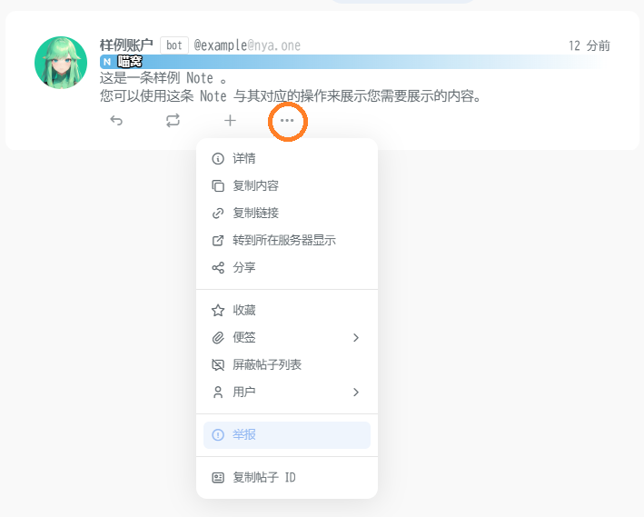
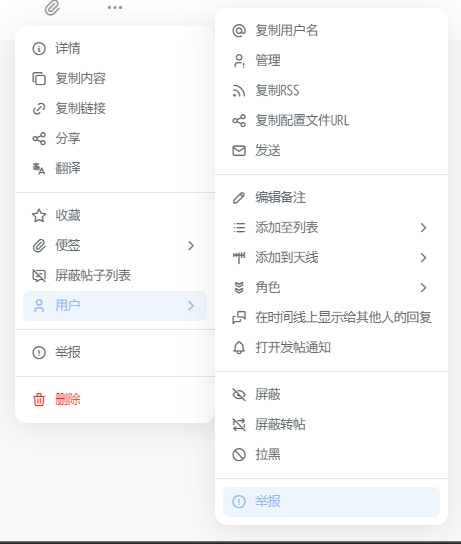
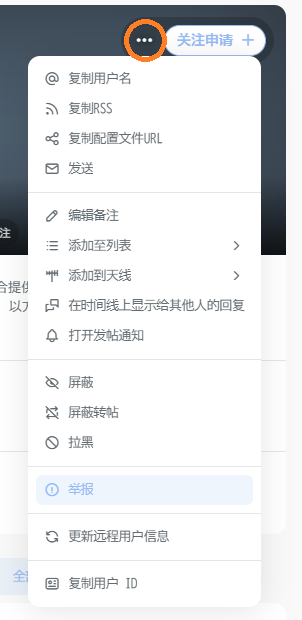
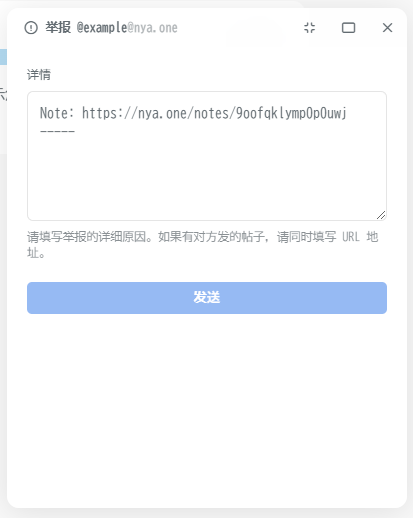

# 检举

::: warning 原则

我们并不认为检举是一种好行为，我们也不提倡检举，但我们更无法容忍破坏用户体验的内容和行为发生。所以，请确保您检举的内容确实违反了相关的条款，请不要将检举功能作为一种公报私仇的方式。

对于**滥用**检举功能的用户，我们也会实施相对应的限制策略。

:::

## 联络对象

- 如若您检举的是一般用户行为，您可以利用**站内检举系统**将相关信息发送给我们。
- 如若您检举的是监察员行为，请参照 [联系我们] 中的描述向管理员团队发送信息。

## 附带内容

为方便管理团队的判断，请您在检举时附带上以下内容：

1. 原始内容的 [网站备份] 。

    为避免原始内容作者悄悄删除其原始内容来反咬一口，我们建议您及时对原始内容进行备份。

    请注意，如果原始内容并非公开内容时，您可能会无法生成可以访问的网站备份，这种情况下您可以忽略这一条。
    
    另外，如果违反规则的用户为外站的用户，且其同样违反了外站的相关规则，我们建议您同时生成其原始内容链接的网站备份一并附上，以方便我们与其实例所在的管理团队取得联系时使用。

    我们不接受截图作为证据，图片是可以被轻易篡改的。

2. 其内容违反的条款。

    请明确标注这一点，以便帮助管理团队快速判断其具体的内容情况。

    如某内容触犯了多条条款，您可以一一将其列出。

    如果没有标注这一点或是标注了大量的无关条文，该次检举会被视为滥用检举功能。

3. 您新的联系方式。

    如果您因遭到了原始内容作者的负面行为，导致您需要销毁或是登出当前账号以避免情绪失控或是人身遭到威胁等情况的发生，且希望管理团队能与您取得联系，请标注您新的联系方式。

    该联系方式可以是 matrix 账号，或是 fediverse 账号。我们不推荐使用电子邮箱（因为喵窝运行的电子邮箱服务是只收不发的），也不推荐任何中心化的通信服务（隐私相关的考虑）。

    请注意新身份与原始身份的隔离，以确保您的安全。

::: details 站内检举系统使用教程

您可以通过对目标 Note 点击右下方 更多 按钮找到 **举报** 功能。

您可以举报单独一条 Note ，或是在扩展的 用户子目录 选择举报这名用户。

如果您需要举报一名用户，您也可以在其主页右上角关注按钮旁 更多 按钮打开 用户子目录 选择举报这名用户。

在举报 Note 时，系统会自动带上该条 Note 的原始链接。请在分割线下方补充上述的 **附带内容**。

在举报用户时，详情输入框是空的，此时您可以直接补充上述的 **附带内容**。

请确保带上了附带内容，以尽可能简化并加速我们的处理流程，非常感谢您的理解与支持。

:::

[联系我们]: /contact/
[网站备份]: /appendix/#网站备份
